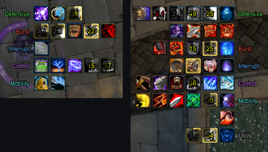
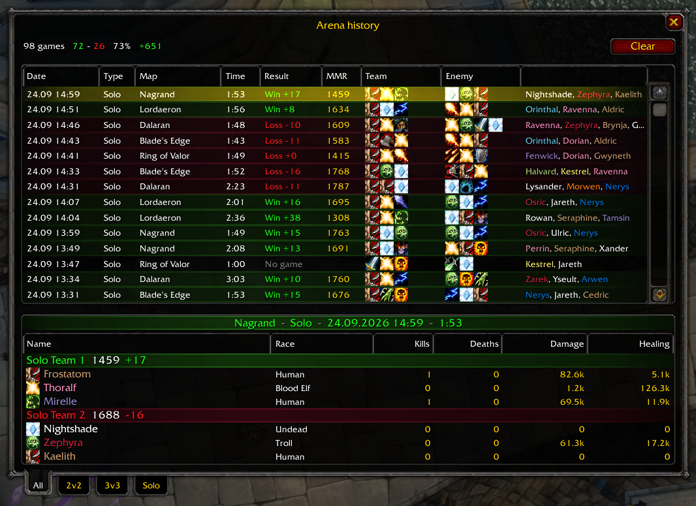
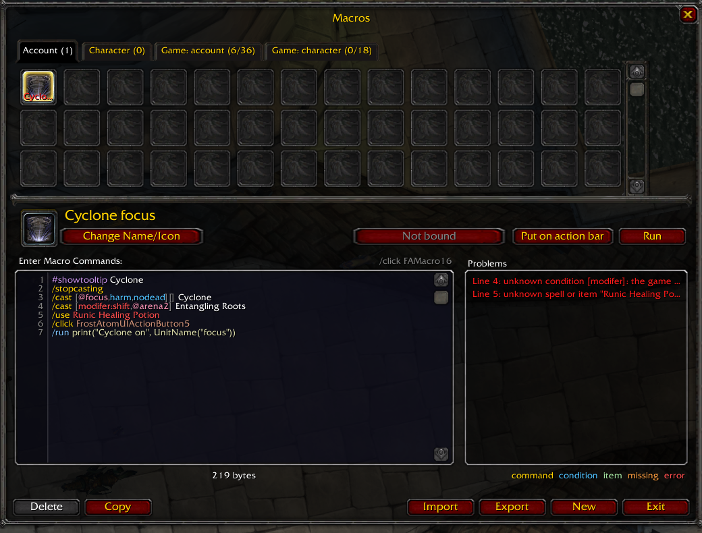
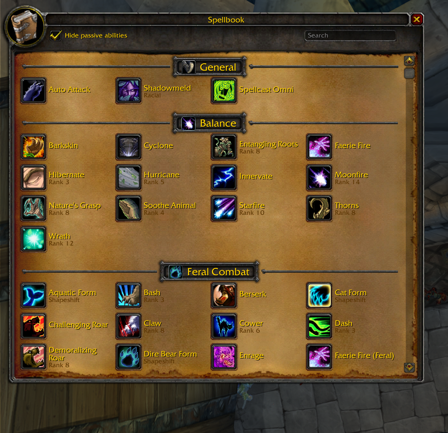
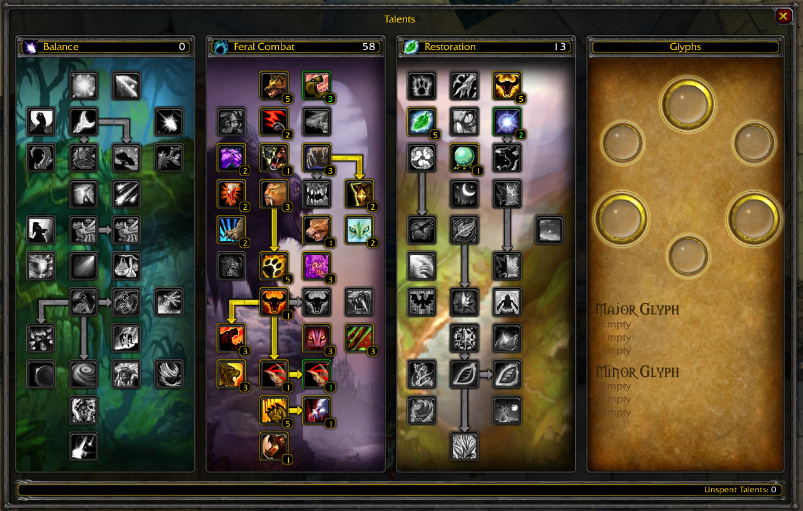
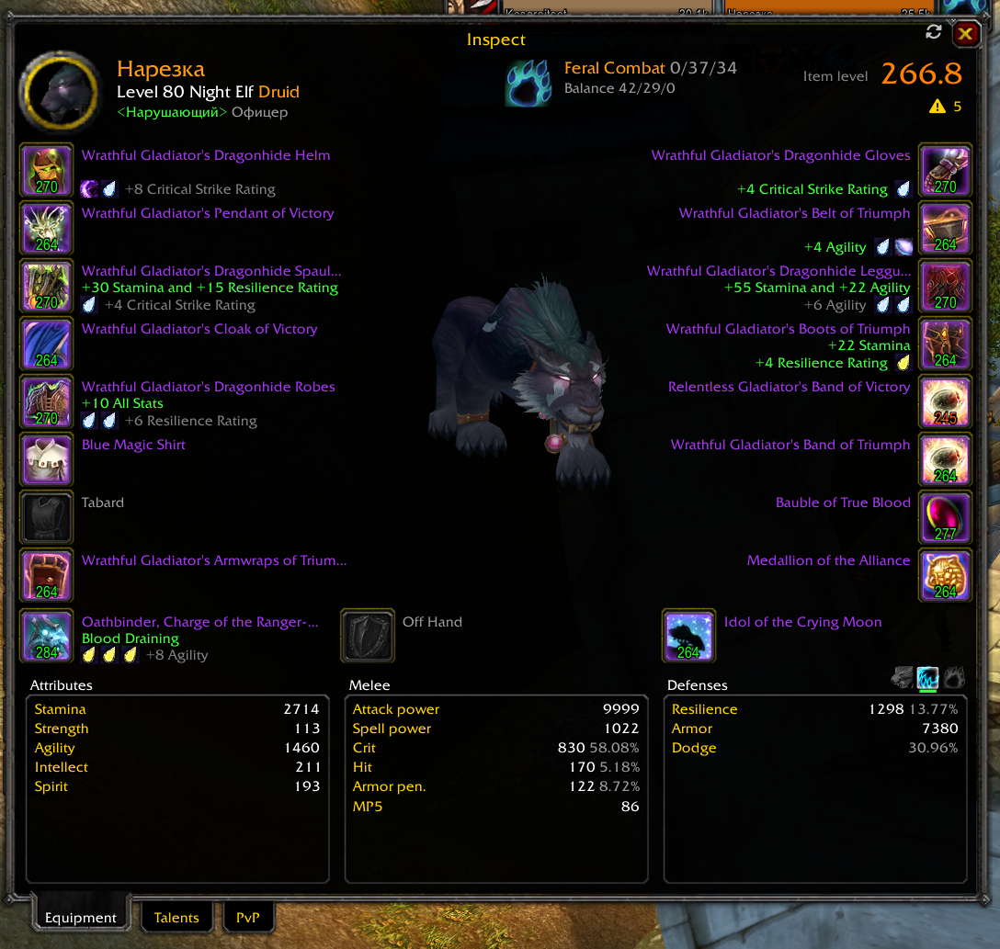
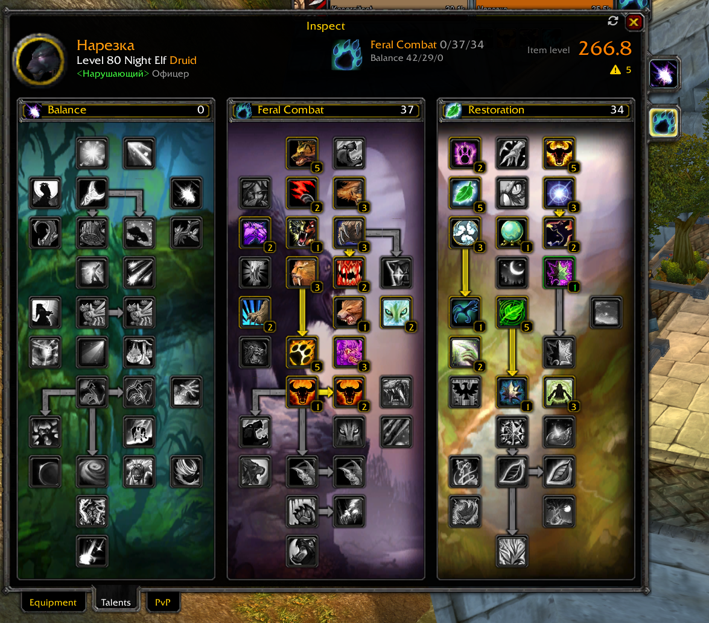
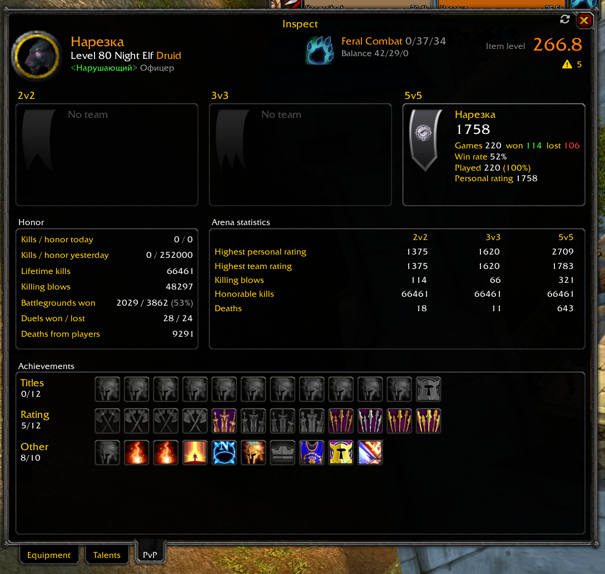

<div align="center">

# ❄️ FrostAtom UI

**The all-in-one PvP interface for World of Warcraft 3.3.5a.**
Install it, log in, queue up: everything you need for arenas and battlegrounds is already on screen.


[](https://discord.gg/HSD3gCYw8Q)

[Install](#install) · [Features](#features) · [Commands](#commands) · [Settings](#settings) · [FAQ](#faq)

</div>


<p align="center"><i>Test mode (<code>/uftest</code>): every frame filled with random casts, auras, cooldowns and diminishing returns.</i></p>

---

## Why FrostAtom UI?

- 🧩 **One addon instead of a dozen.** Action bars, unit frames, arena frames, nameplates, castbars, cooldown timers,
  aura trackers, bags and chat: all in one package that looks and behaves the same everywhere.
  No more Bartender + Gladius + TidyPlates + Quartz + OmniCC + TellMeWhen + Bagnon + Prat.
- ⚔️ **Made for arena.** Diminishing returns, enemy trinkets and cooldowns, kicks, crowd control, stealthed
  opponents, and a match history that remembers every game.
- 🚀 **Ready out of the box.** Sensible defaults. Log in and play, and tweak later if you want to.
- 🎯 **See the fight, not the clutter.** Important casts glow, casts aimed at you get a red border, everything
  you can't use while crowd controlled turns red on your bars.
- 🛠️ **Every pixel is yours.** Drag any frame, resize it, snap it to others, and share your layout with friends
  as a text string.
- 🌍 **English and Russian**, picked automatically from your game client.

> The project is under active development, so options may move around between versions.
> Questions, ideas and bug reports: **[Discord](https://discord.gg/HSD3gCYw8Q)**.

---

<a id="install"></a>

## 📦 Installation

1. Download the latest version: **Code → Download ZIP**.
2. Unpack it. Inside are two folders: `FrostAtomUI` and `FrostAtomUI_Config`.
3. Move **both** of them to your game's addon folder:

   ```
   World of Warcraft\Interface\AddOns\FrostAtomUI
   World of Warcraft\Interface\AddOns\FrostAtomUI_Config
   ```

4. Restart the game completely (`/rl` doesn't load new addons) and make sure **FrostAtom UI** is ticked in the
   *AddOns* list on the character selection screen.

That's it. Type **`/fui`** in game to open the settings.

> 💡 FrostAtom UI replaces the action bars, unit frames, nameplates, minimap, bags and chat. If you run addons that
> do the same job, it will ask which one to keep the first time it sees them.

---

<a id="features"></a>

## ⚔️ Unit frames & castbars

*Clean frames that tell you everything at a glance: who is casting what, at whom, and whether you can stop it.*


- **Player, pet, target, focus, target of target and target of focus**, plus party, arena and boss frames.
- **Incoming heals and shields** right on the health bar. Absorbs such as Power Word: Shield, Divine Aegis,
  Sacred Shield or Ice Barrier shrink as they soak damage.
- **Smooth health bars.** Lost health leaves a fading strip, so you can see burst damage coming in.
- **Health color of your choice:** class color, or red → amber → green by health percent.
- **Dispellable debuffs** tint the bar, **purgeable buffs** get a highlight, and a **crowd control icon** sits
  on top of the frame while someone is locked down.
- **Vehicles** in Wintergrasp, Strand of the Ancients and Isle of Conquest show the vehicle's health and power.
- Right-click any frame for whisper, invite, focus, inspect or **copy name**.

**Castbars that read the fight for you**, on every frame and every nameplate:

- 🎯 the name of the player the spell is aimed at, and a **red border when it's aimed at you**;
- ✨ a pulsing **gold glow on dangerous casts**: crowd control and heals;
- 🛑 *Interrupted by &lt;name&gt;* in red when someone kicks it, a grey *Cancelled* when the caster fakes it;
- 🛡️ casts that can't be kicked right now (Divine Shield, Ice Block, Aura Mastery, …) are marked as such;
- channel ticks, your latency on your own castbar, remaining or *elapsed / total* time.

| Party | Arena |
|:---:|:---:|
|  |  |
| Gold border on your target, blue on your focus, fading out of range | Trinket, cooldowns, DR and a frozen frame for stealthed enemies |

---

## 🏟️ The arena toolkit

*Everything a gladiator tracks in their head, on screen.*

- **Diminishing returns** next to every arena frame (and on target and focus if you like): one icon per
  category (stuns, fears, silences, roots, cyclone, …) with a timer. The border tells you what the next CC does:
  🟢 half duration, 🟠 a quarter, 🔴 immune.
- **Trinkets and proc cooldowns.** PvP trinkets, plus when Deathbringer's Will, Greatness, Lightweave, Black Magic
  and friends can proc again. Enemy trinkets start as a question mark, fill in after their first proc and are
  remembered for next time.
- **Stealthed and hidden enemies stay on screen.** Their frame fades and keeps the last known health and power.
  **Before the gates open**, preparation frames show how many enemies to expect and fill in class, spec and name
  as soon as they are seen.
- **Every cooldown of both teams**, always visible, in two panels under the party and arena frames. Rows group
  them by type (defensive, burst, interrupt, control, mobility, utility), dark with a timer while on cooldown,
  glowing while active, flashing when ready. Pick exactly which spells you care about for every class.



- **Loss of control alert** in the middle of the screen: *Stunned*, *Feared*, *Silenced*, *Rooted*, *Frost locked*
  after a kick, with the seconds left.
- **Player plate:** your own health, power and castbar right under your character, where your eyes already are.
- **External defensives:** a row of what your team puts on you (Pain Suppression, Guardian Spirit, Hand of
  Protection, Innervate, Power Infusion, Grounding, …), longest first.


---

## 🎯 Nameplates


- Same look as the unit frames: name inside the bar, health percent on your target.
- **Casts and crowd control on every plate**, not only your target's: focus, mouseover, arena opponents
  and whatever your group is targeting, plus enemy players in battlegrounds.
- **Auras sorted by importance:** your CC first, then others' CC, enemy defensives (Divine Shield, Ice Block,
  Cloak of Shadows, …), your debuffs and purgeable buffs, with CC icons drawn larger.
- **Arena numbers** on enemy plates, class colors for friends, a **heal icon over enemy healers** in battlegrounds.
- Totem icons instead of totem plates, your target always on top, optional spreading of overlapping plates.

---

## 📜 After the fight

**Match results.** When an arena or battleground ends you get a proper summary: result, map, duration, rating
change, team MMR and a sortable scoreboard with your row highlighted, plus a countdown until the instance closes.

**Arena history** (`/history`). Every 2v2, 3v3 and solo queue game is saved with the full scoreboard: map, time,
rating change, MMR, and each player's class, spec, race, kills, damage and healing. Filter by bracket, click a game
for the details. Your win rate is at the top.



**Death recap** (`/recap`). What killed you in the last 10 seconds: spell, caster, amount, the killing blow marked
with a skull and the biggest hit in red. Hover a line to see crits, overkill, absorbs and your health at that moment.
A clickable *[Death recap]* link appears in chat after every death. In arenas, **every player's death** gets one,
yours, your teammates' and the enemies'.

| Death recap | Chat link |
|:---:|:---:|
|  |  |

---

## 🔔 Alerts that have your back

- **Targeted by X:** a sound and an on-screen line when an enemy player targets you.
- Sounds when your target or focus starts **a cast you can kick**, when **a dispellable debuff** lands on you
  and when **your interrupt lands**. Each one can be turned off.
- **Queue pop:** a countdown above the invite (red for the last 10 seconds), the invite sound even with game sounds
  muted, and a full-screen flash so you never miss it while alt-tabbed.
- **Low health:** the screen edges pulse red below 33%.
- **Solo queue button** by the minimap *(WoW Circle)*: one click to join, leave or enter, with the current rating
  range and your time in queue.

---

## 🧊 Trackers & timers

- **Trackers:** your own lightweight TellMeWhen. Build groups of icons that watch buffs, debuffs, spell and item
  cooldowns, totems, trinket procs, enemy cooldowns or diminishing returns on any unit. Show the icon when the aura
  is up or missing, when a spell is ready or on cooldown; turn it red out of range and blue when you lack the power.
  Limit groups to a class, a spec, combat, arenas or battlegrounds. Useful class groups come preinstalled.
- **Cooldown numbers on every icon** (tenths under 3 seconds, red when about to expire).
- Your own buffs and debuffs next to the minimap, Death Knight runes, shaman totem timers, weapon enchant timers.

---

## 🕹️ Action bars


- Five compact bars plus pet, stance and a sixth bar, with spacing per bar.
- **Crowd control overlay:** while you're stunned, feared, polymorphed or silenced, every ability you can't use turns
  red with a timer, and the ones that break CC (PvP trinket, Every Man for Himself, Ice Block, Blink, …) stay clear.
- **Out of range** turns the icon and hotkey red; cooldowns can grey out the icon.
- **Fade on mouseover,** or show a bar only in or out of combat.
- **Quick keybinding:** type `/bind` (or press *Bind keys* on the Action bars settings page), hover a button, press a key.
- No more accidentally dragging spells off your bars: pick them up with Alt + right click (or the combo you choose).
- Vehicle exit button, totem bar, pet bar with autocast marks, the rogue Shadow Dance page.

---

## 📝 Macros without limits



- `/macro` opens a new editor with **no limit** on the number of macros or on their length.
- **Syntax highlighting** with a live problem list: typos in conditions, spells you don't know, items missing from
  your bags and broken `/click` or `/run` lines are pointed out by line.
- Bind a key right in the window, pick an icon with search, or let it follow the first spell.
- **Import / export** as a text string: one macro, a tab or all of them, perfect for sharing setups.

---

## 📖 Spellbook & talents

| Spellbook | Talents & glyphs |
|:---:|:---:|
|  |  |

- **Spellbook** on a single scrolling page with **search** and a *Hide passive abilities* switch. Click to cast,
  Shift-click to link, drag to a bar.
- **All three talent trees side by side** with dual spec switching, a talent preview before you learn, and
  **glyphs** in a column right next to them.

---

## 💬 Chat

- Short channel tags (`[P]`, `[R]`, `[BG]`, `[W from]`), timestamps, class-colored names.
- **Clickable links**: click a URL to copy it.
- **History survives a reload,** and a *scroll to bottom* button flashes when new messages arrive.
- **Less spam:** battleground join/leave floods are folded into one line, arena preparation noise is hidden,
  repeated AFK replies are shown once.
- `/wt ` whispers your target, `/gr ` talks to raid, party or say, whichever applies.
- `/nodm` blocks whispers from strangers (friends still get through) with an optional auto-reply.
- Styled chat bubbles with raid icons.

---

## 🗺️ Minimap, map & bags

| Minimap with your auras | Bags |
|:---:|:---:|
|  |  |

- Square minimap, addon buttons tidied into one panel, FPS and latency in the corner.
- Transparent, movable world map you can play with open, with coordinates.
- **All bags and bank in one window** with sorting, quality borders and your honor and arena points.
- **Smart search:** `q:epic`, `ilvl>=251`, `t:plate`, `tt:resilience`, `s:<equipment set>`, `boe`, `!` to negate.
- Unusable items tinted red, **bank viewable anywhere**, every character's gold on hover, lock slots from sorting
  with Alt + click.

---

## 🔍 Tooltips & character

| Tooltip | Character window |
|:---:|:---:|
|  |  |

- Player tooltips show **item level and talent spec**, **arena ratings** of friendly players, guild rank and
  what they are targeting.
- Item and spell tooltips show IDs, item level and how many you carry.
- Buffs and debuffs with timers above unit tooltips.
- **Item level on every slot** of the character window, average under the model.
- Rotate, move and zoom the character model with the mouse.

---

## 🕵️ Inspect



| Both talent specs | Arena & PvP record |
|:---:|:---:|
|  |  |

A new inspect window with everything the client can tell about a player.

- **Every item** with item level, enchant, gems and socket bonus. Missing enchants, empty sockets, a missing belt
  buckle and inactive meta gems are flagged, and a **gear check** icon by the average item level counts them.
- **Real character stats, not just gear totals:** base stats, gear, set bonuses, talents and racials, stacked
  the way the server does it. Resilience, crit, haste, hit, expertise, armor pen., dodge, parry and block
  come with percentages, grouped into attributes, offense and defenses.
- **Switch stance / form / presence / aspect** to see the stats in it. A cat druid shows its cat numbers, and
  crit is listed for every spell school.
- Hover a stat to see **where every point comes from**.
- **Both talent specs** as full trees, with the spec icons on the side to switch between them.
- **Arena teams** (rating, games, win rate, personal rating), honor, battleground and duel records,
  **arena statistics** per bracket and **PvP achievements** (Gladiator titles, rating milestones) with dates.
- Opened on your target, the window **follows target changes**, including yourself.

---

## 🛠️ On autopilot

| When | What happens |
|---|---|
| You visit a vendor | Grey items sold, gear repaired, from guild funds if allowed (hold **Shift** to skip) |
| A friend or guild mate invites you | Accepted |
| You interrupt a spell | Announced to your group (`/ia` toggles it) |
| You die in a battleground | Spirit released right away, unless a soulstone or Reincarnation is ready |
| A battleground ends | Warnings 10, 5 and 1 min and 15 s before the instance closes |
| The arena countdown starts | Big timer on screen, Ring of Valor pillar timer |
| Duels, group invites, trades | Declined silently with `/noduel`, `/noparty`, `/notrade` |
| You delete a good item | `DELETE` is typed for you |
| The same red error again and again | Flashes once instead of stacking; "not ready yet" spam hidden |

---

## 🎮 Game client tweaks

Hidden game settings, one click away and all off until you turn them on:

- **Camera:** faster zoom, mouse look speed beyond the game's limits, a smoother follow style.
- **Controls:** casting no longer cancels your form, stance or mount, Windows-exact mouse speed.
- **Graphics:** no screen glow, grey death screen or sun glare, brighter characters in dark arenas,
  crowd control text over every unit, full view distance on old maps.
- **Performance:** FPS limits, fewer freezes when players appear at the start of an arena.
- **Sound:** quieter armor rustle, positional sound from your character's head.

---

<a id="settings"></a>

## ⚙️ Make it yours


Type **`/fui`** or press **Esc → FrostAtomUI**. Every module has its own page with sizes, positions, fonts, colors and
visibility, and nearly everything applies instantly.

- 🔎 **Search** any option: `/fui castbar` or `/fui arena trinket`. New options wear a **NEW** badge.
- 🧪 **Test buttons** preview frames, DR, loss of control and alerts without waiting for a fight.
- 🧲 **Unlock frames** (`/fui unlock`) and drag anything anywhere. Frames snap to each other and to the screen,
  stay attached when you move their neighbor, resize from the corner and nudge with the arrow keys.
- 👥 **Profiles** per character, plus **layouts** you can export as a string and share with friends, positions only,
  without touching their colors or fonts.
- 🔄 Reset a page, reset everything, or reset positions. UI scale changes revert on their own if you don't confirm.

---

<a id="commands"></a>

## ⌨️ Slash commands

| Command | What it does |
|---|---|
| `/fui [page or text]` | Open settings, jump to a page or search (`/fui chat`, `/fui castbar`) |
| `/fui unlock`, `/fui lock` | Move frames around / lock them back |
| `/fui reset` | Reset every frame position (asks first) |
| `/uftest` | Fill every unit frame with test data |
| `/cdtest` | Fake cooldowns on your party and arena members |
| `/bind`, `/b` | Keybinding mode for action buttons |
| `/macro` | Macro editor |
| `/history`, `/ah` | Arena history |
| `/recap` | Death recap |
| `/sort`, `/sortbank` | Sort bags / bank; `/sort unlock` clears slot locks |
| `/nodm [message]` | Block whispers from strangers, with an optional auto-reply |
| `/noduel`, `/noparty`, `/notrade` | Auto-decline duels, invites, trades (`on`, `off`, `status`) |
| `/ia` | Interrupt announcements on / off |
| `/wt <text>`, `/gr <text>` | Whisper your target / talk to your group |
| `/copy` | Copy text from the current chat tab |
| `/clear`, `/clearall` | Clear the current / every chat tab |
| `/vr` | Turn off the button click flash for video recording |
| `/rl` | Reload the UI |

**Key bindings** (*Esc → Key Bindings → FrostAtomUI*): focus mouseover (mouse button 5 by default) and three camera
distance presets.

---

<a id="faq"></a>

## ❓ FAQ

**Do I need to remove my other addons?**
Only the ones that do the same job (Bartender, ShadowedUF, Gladius, sArena, TidyPlates, Quartz, Bagnon, Prat, …).
FrostAtom UI notices them and asks whether to disable that addon, turn off its own module, or keep both.

**Does it work on my server?**
It needs the **3.3.5a** client (build 12340) and works on any Wrath private server. A few extras (solo queue button,
arena queue summaries) need WoW Circle, and the *Spectate* menu entry needs a server with spectator mode.

**Does it support 5v5?**
Party and arena frames are built for 2v2 and 3v3.

**How do I keep my settings when I reinstall or move to another PC?**
Copy `WTF\Account\<account>\SavedVariables\FrostAtomUI.lua`. It holds your settings, chat history and arena history.
Or export a profile string from the *Profiles* page.

**Can I play in Russian?**
Yes. The language follows your game client, and you can switch it under *General → Language*.

---

<div align="center">

**Something missing? Found a bug? Got a cool layout to share?**
Come say hi on **[Discord](https://discord.gg/HSD3gCYw8Q)**.

</div>
