# FrostAtom UI

A complete, lightweight interface replacement for **World of Warcraft 3.3.5a** built around PvP:
action bars, unit frames, nameplates, chat, minimap, bags and a set of arena/battleground helpers —
all in one addon, ready to play right after install.

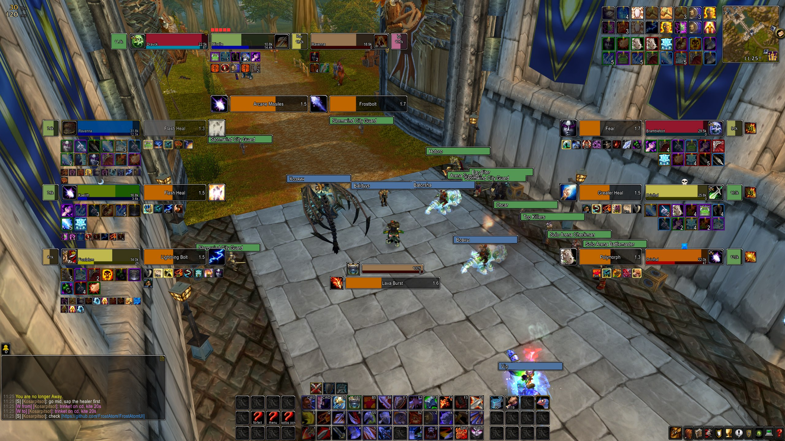

*Unit frame and cooldown test modes (`/uftest`, `/cdtest`) — every frame filled with random data.*

> The project is under active development and the settings window is still **work in progress** —
> some options are missing or may move around between versions.
> Questions, ideas and bug reports: **[Discord](https://discord.gg/HSD3gCYw8Q)**.

---

## Installation

1. Download the latest version: **Code → Download ZIP** (or `git clone` this repository).
2. Unpack the archive and open it. Inside are the `FrostAtomUI` and `FrostAtomUI_Config` folders.
3. Move both folders to your game's addon directory:

   ```
   World of Warcraft\Interface\AddOns\FrostAtomUI\FrostAtomUI.toc
   World of Warcraft\Interface\AddOns\FrostAtomUI_Config\FrostAtomUI_Config.toc
   ```

4. Start the game (fully restart the client if it is already running — `/rl` does not pick up new addons) and make sure **FrostAtom UI** is enabled
   in the *AddOns* list on the character selection screen.

> **Tip:** the addon replaces Blizzard's action bars, unit frames, nameplates, minimap, bags and chat.
> Disable other addons that do the same (Bartender, ShadowedUF, TidyPlates, Bagnon, Prat, …) to avoid conflicts.

---

## What you get

### ⚔️ Unit frames

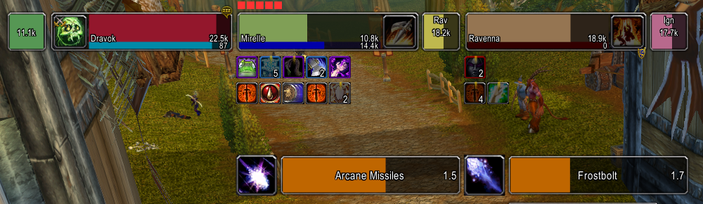

- Player, pet, target (with combo points), focus, target-of-target, target-of-focus.
- Target and focus show debuffs, then buffs (two rows each) and a castbar at a fixed spot below them.
- Party frames (up to 3 members, 5v5 is not supported) with pets; **arena frames** with pets, PvP trinket status and enemy cooldowns; boss frames.
- Party and arena frames get a gold border when targeted and a blue one when focused.
- Health bars glide smoothly; lost health leaves a fading strip so you can see burst damage.
- Debuffs you can dispel tint the health bar; buffs you can purge get a highlight frame.
- Crowd-control icon ("lose control") on top of every frame, class icons, range fading for party members.
- Right-click menu on every frame (whisper, invite, focus, inspect, …).

| Party | Arena |
|---|---|
| 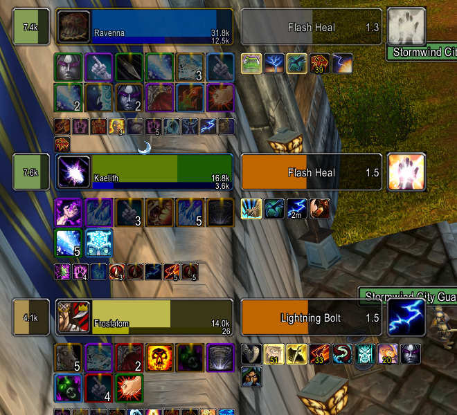 | 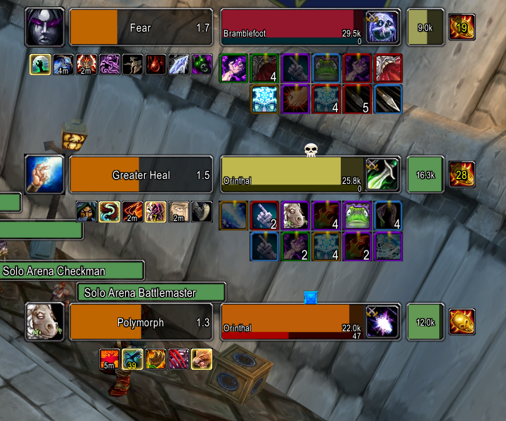 |

A compact **player plate** with your own health & power sits just below the character while you are in
combat or hurt, with your castbar right under it. Warriors also see the equipped shield's icon next to it.

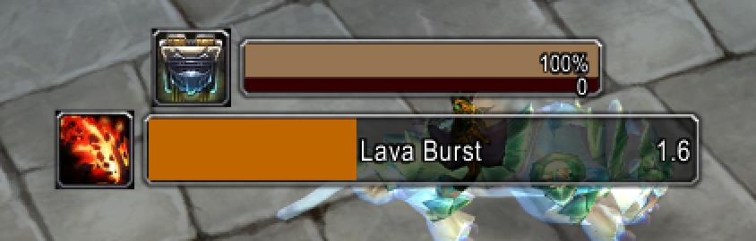

### 🎯 Nameplates

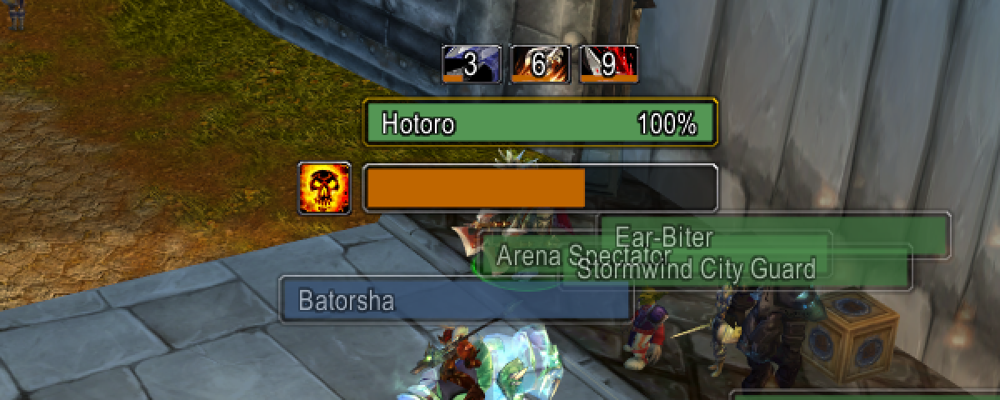

- Nameplates in the same style as the unit frames: name inside the bar, health percent on your target,
  castbar with spell icon, CC and your own debuffs with timers above the target plate.
- Totem icons instead of totem plates.
- In battlegrounds, enemy **healers get a heal icon** on their plate.

### 🧊 Cooldowns & auras
- Enemy and party cooldown tracker (trinkets, defensives, interrupts, racials) with shared-cooldown
  and talent-reset logic, shown as icons next to arena/party frames. Type `/cdtest` to preview it.
- Class-specific proc & buff tracker around the screen center (e.g. Sudden Death, Infusion of Light,
  Water Shield, DK diseases on target).
- Your own buffs and debuffs next to the minimap.
- Runes for Death Knights, totem timers for Shamans, weapon enchant timers.

### 🕹️ Action bars

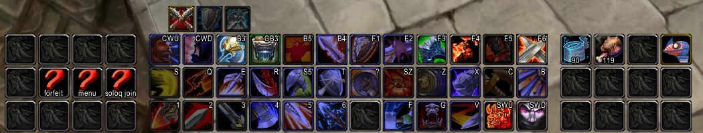

- 5 bars, pet bar and stance bar with a compact look.
- **Keybinding mode:** type `/bind`, hover a button and press a key. `Esc` closes it.
- Click flash on button presses (`/vr` turns it off for video recording).

### 💬 Chat

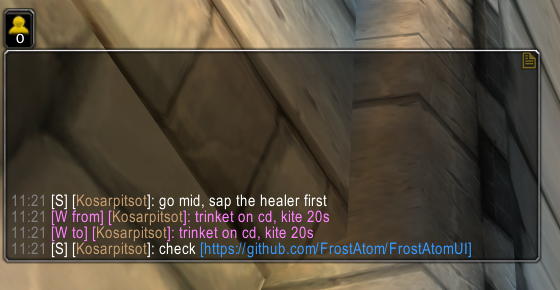

- Compact channel names (`[P]`, `[R]`, `[BG]`, `[W from]`), timestamps, class-colored names.
- Clickable **URLs** — click to copy.
- The last 100 lines come back after a reload; hover a link to see its tooltip.
- Type `/wt ` (or `/tt `) and press Space to whisper your current target; `/gr ` to switch to the
  group channel (raid / party / say, whichever applies).
- Arena queue spam ("Number of groups in queue…", rating searches) is folded into short one-liners,
  and preparation spam inside the arena (loot mode, raid joins, countdown, "X has died") is hidden.
- Restyled chat bubbles with raid icons (`{skull}`, `{x}`, …).

### 🗺️ Minimap, map & bags

| Minimap with your auras | Bags |
|---|---|
| 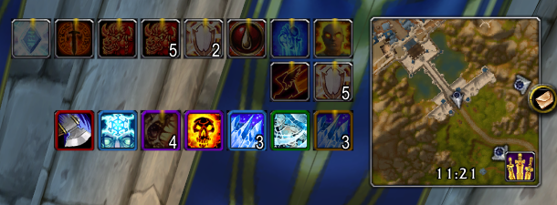 | 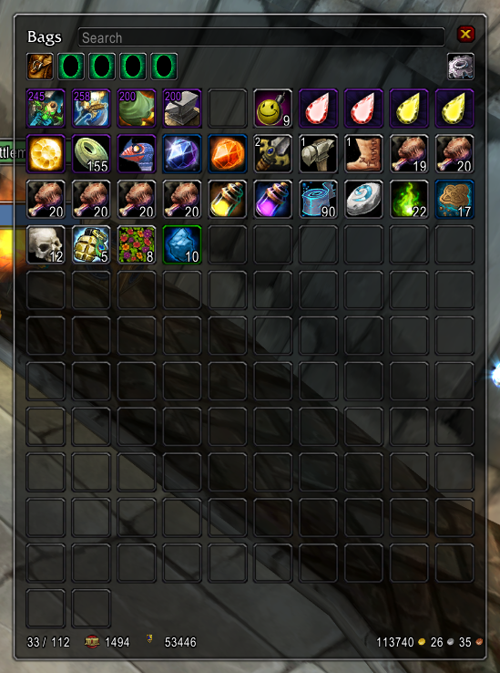 |

- Square minimap in the top-right corner: wheel to zoom, right-click for tracking, middle-click for the calendar.
- **Solo queue button** in the minimap's bottom-right corner: click to join the solo 3v3 queue (sends `.soloq join`
  as a whisper to yourself), click again to leave the queue, enter the arena in one click once the match is ready,
  and leave the arena in one click while inside. The rating range the queue is currently searching in is shown
  under the button (gold once a team is found) instead of the "Searching team" chat message.
- **Arena history** (`/history`): every finished 2v2 / 3v3 / solo queue match is saved with the full scoreboard —
  map, duration, result and rating change, team MMR, and for every player their class/spec icon, race, kills,
  deaths, damage and healing. Filter by bracket, click a game for the details, right-click to delete it.
- FPS / latency readout in the top-left corner; the numbers turn amber and red as things get worse.
- Transparent, movable world map that doesn't lock you out of the game; player coordinates on the map.
- Single-window **bags and bank** with a sort button, item quality borders, quest item marks.

### 🛠️ Everything automatic
| When | What happens |
|---|---|
| Visiting a vendor | Grey items are sold and gear is repaired (hold **Shift** while opening to skip) |
| A friend or guild mate invites you | Invite is accepted automatically |
| You interrupt a spell | Announced to your group (toggle with `/ia`) |
| Someone challenges you to a duel | Declined automatically if `/noduel` is on |
| Deleting a good item | The `DELETE` confirmation is typed for you |
| Entering / leaving combat | `+ combat` / `- combat` flashes on screen |
| Health drops below 33% | Screen edges pulse red |
| Battleground messages | Shown as big raid warnings in the middle of the screen |
| Arena countdown | Big timer on screen; Ring of Valor pillar timer next to the chat |
| Paladin uses Aura Mastery with Concentration Aura | `<<< AURA MASTERY >>>` announced to the group |
| Mouse wheel over vendor, spellbook, mail, auction, calendar | Flips pages |

### 🔍 Tooltips & character window

| Tooltip | Character window |
|---|---|
| 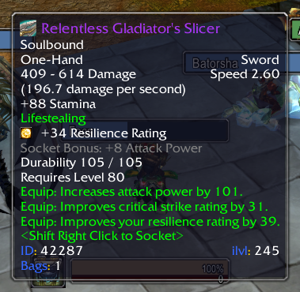 | 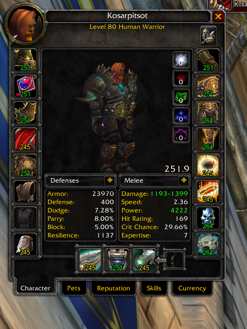 |

- Spell and item tooltips show their **ID**, item level and how many you carry in bags/bank.
- Player tooltips show **average item level** (inspects nearby players automatically) and guild.
- Character and Inspect windows show the item level on every slot and the average under the model.
- Drag the model with the left mouse button to rotate, right button to move, wheel to zoom.
- Friends / team member menus get a **Spectate** entry.

---

## Keybindings

| Binding | Default | Where to change |
|---|---|---|
| Focus mouseover | Mouse button 5 | `Esc → Key Bindings → FrostAtomUI` |
| Action buttons | — | `/bind` |

---

## Slash commands

| Command | Description |
|---|---|
| `/bind`, `/b` | Keybinding mode for action buttons |
| `/pm` | Toggle blocking whispers from strangers (friends still get through; blocked messages are shown when you turn it off) |
| `/copy` | Open a window to copy text from the current chat tab |
| `/history`, `/ah` | Toggle the arena history window |
| `/clear`, `/clearall` | Clear the current / all chat tabs |
| `/gr <text>` | Send a message to raid, party or say — whichever is active |
| `/ia` | Toggle interrupt announcements to the group |
| `/noduel` | Toggle automatic duel decline |
| `/vr` | Toggle the button click animation (for video recording) |
| `/cdtest` | Preview the cooldown tracker |
| `/uftest` | Toggle unit frame test mode: every frame is shown with random data |
| `/guid` | Print your target's GUID |
| `/rl` | Reload the UI |
| `/fui` | Open the settings window |

---

## Customizing

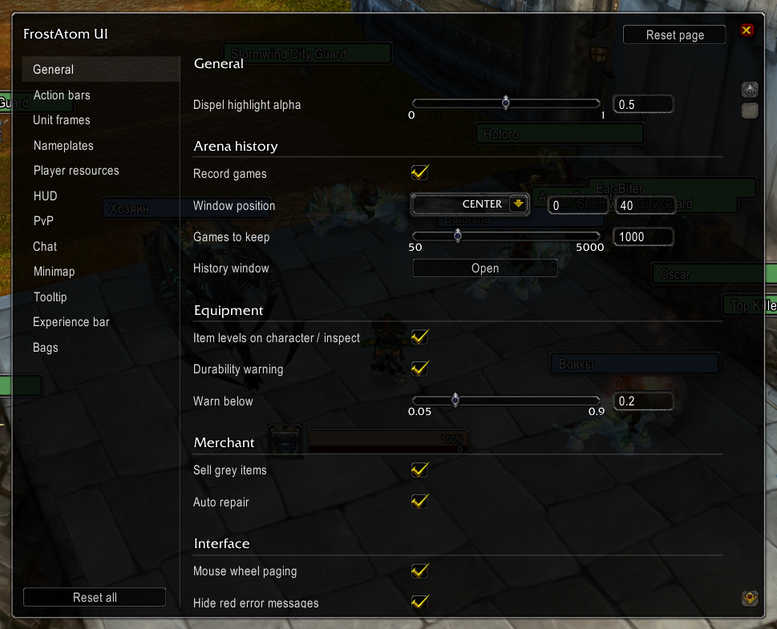

Type `/fui` (or `/ui`, `/faui`, `/frostatomui`) to open the settings window — positions, sizes and
other options apply immediately, no reload needed. The window lives in the separate `FrostAtomUI_Config`
addon, which is only loaded when you open it. Defaults are listed in `FrostAtomUI/Core/Config.lua`.

The settings window is **WIP**: not everything is exposed yet and new options are added regularly.
If something you need is missing, ask in [Discord](https://discord.gg/HSD3gCYw8Q).

Your settings (`/pm`, `/noduel`, chat history, …) are saved per account in `WTF\Account\<name>\SavedVariables\FrostAtomUI.lua`.

---

## Requirements & compatibility

- Client **3.3.5a** (build 12340). Other versions are not supported.
- Written for Wrath private servers; some features (arena queue summaries, spectator entry) rely on
  server-side messages that may look different elsewhere.

---

## For developers

Formatting is done with [StyLua](https://github.com/JohnnyMorganz/StyLua) (`stylua.toml`),
linting with [luacheck](https://github.com/lunarmodules/luacheck) (`.luacheckrc`).

```
npm install            # installs stylua
npm run format         # format everything
npm run format:check   # CI-style check
luacheck .             # needs luacheck on PATH
```

Both checks run on GitHub Actions for every push and pull request (`.github/workflows/lint.yml`).

Every file starts with `local _, ns = ...`; `ns` is the shared addon table. A module is
`ns:NewModule("Name")` and subscribes to events with `module:RegisterEvent(event, handlerOrMethodName)`.
`Core/Bootstrap.lua` must stay last in the `.toc`.
