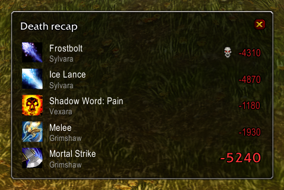

# FrostAtom UI

A complete, lightweight interface replacement for **World of Warcraft 3.3.5a** built around PvP:
action bars, unit frames, nameplates, chat, minimap, bags and a full set of arena/battleground tools —
diminishing returns, loss-of-control alerts, match results, death recap and more —
all in one addon, ready to play right after install.


*Unit frame test mode (`/uftest`): every frame is filled with random data — casts, auras, cooldowns, DR, heal prediction.*

> The project is under active development — options may move around between versions.
> Questions, ideas and bug reports: **[Discord](https://discord.gg/HSD3gCYw8Q)**.

---

## Installation

1. Download the latest version: **Code → Download ZIP** (or `git clone` this repository).
2. Unpack the archive and open it. Inside are the `FrostAtomUI` and `FrostAtomUI_Config` folders.
3. Move both folders to your game's addon directory:

   ```
   World of Warcraft\Interface\AddOns\FrostAtomUI\FrostAtomUI.toc
   World of Warcraft\Interface\AddOns\FrostAtomUI_Config\FrostAtomUI_Config.toc
   ```

4. Start the game (fully restart the client if it is already running — `/rl` does not pick up new addons) and make sure **FrostAtom UI** is enabled
   in the *AddOns* list on the character selection screen.

> **Tip:** the addon replaces Blizzard's action bars, unit frames, nameplates, minimap, bags and chat.
> Disable other addons that do the same (Bartender, ShadowedUF, TidyPlates, Bagnon, Prat, …) to avoid conflicts.

---

## What you get

### ⚔️ Unit frames


- Player, pet, target (with combo points), focus, target-of-target, target-of-focus.
- Target and focus show debuffs, then buffs (two rows each) and a castbar at a fixed spot below them.
- Party frames (up to 3 members, 5v5 is not supported) with pets; **arena frames** with pets, PvP trinket status,
  enemy cooldowns and diminishing returns; boss frames.
- Party and arena frames get a gold border when targeted and a blue one when focused.
- Health bars glide smoothly; lost health leaves a fading strip so you can see burst damage.
- **Heal prediction and absorbs:** incoming heals extend past the health fill (LibHealComm plus your own,
  party and arena casts), shields (Power Word: Shield, Divine Aegis, Sacred Shield, Ice Barrier, wards,
  Anti-Magic Shell, …) are drawn over the bar and shrink as they soak damage.
- Health bar color of your choice: class color, or one mixed from the current health percent
  (red through amber to green, same softness at every percent) — separately for unit frames,
  nameplates and the player plate.
- Debuffs you can dispel tint the health bar; buffs you can purge get a highlight frame.
- Crowd-control icon on top of the target, focus, party and arena frames, class icons, range fading for party members.
- Right-click menu on every frame (whisper, invite, focus, inspect, **copy name**, …); *Report AFK* in
  battlegrounds asks for confirmation first.
- **Vehicles:** the player, pet and party frames switch to the vehicle's health and power (Wintergrasp,
  Strand of the Ancients, Isle of Conquest) and switch back when you get out.
- Remaining time on every aura icon (long buffs can be left without a number); your own buffs are cancelled
  with a right click even in combat; your own auras on the target and focus can be drawn larger;
  player debuffs have their own size, and buffs can be sorted yours first or by time left.
- Incoming heals split into yours and everyone else's, druid mana while shapeshifted (text on the player frame,
  a thin bar on the player plate), a PvP flag countdown, an optional combat glow, pet power and hunter pet
  happiness, horizontal party layout, and target of target hidden while it's you (optional).

**Castbars** everywhere (player, target, focus, party, arena, nameplates):

- the class-colored name of whoever the spell is aimed at, and a **red border when it is aimed at you**;
- a pulsing gold glow on important casts — crowd control and heals;
- *Interrupted by &lt;name&gt;* in red for a second when a cast is kicked or silenced, a grey *Cancelled* when it's
  stopped by the caster (a juke), a white flash when it finishes;
- casts that can't be kicked because of Divine Shield, Ice Block, Cloak of Shadows, Burning Determination or
  Aura Mastery are shown as uninterruptible;
- tick marks on channels (Drain Life, Mind Flay, Penance, Arcane Missiles, …), your latency at the end of
  your own castbar, and time left or *elapsed / total*;
- each frame's castbar can be turned off separately.

| Party | Arena |
|---|---|
|  |  |

A compact **player plate** with your own health & power sits just below the character while you are in
combat or hurt, with your castbar right under it, incoming heals and absorbs on the bar, and power hidden if you like.
Warriors also see the equipped shield's icon next to it.


*Top to bottom: loss-of-control alert, a tracker group (Sudden Death, Taste for Blood), the player plate
with its castbar, and defensive cooldowns other players put on you.*

### 🎯 Nameplates


- Nameplates in the same style as the unit frames: name inside the bar, health percent on your target,
  castbar with spell icon, CC and your own debuffs with timers above the target plate.
- The castbar carries the same extras as on the unit frames: the name of who the spell is aimed at,
  a red border when it is you, a glow on important casts, a shield on casts that can't be interrupted.
- **Casts and auras on every plate, not only your target:** plates are matched to your focus, mouseover,
  arena opponents and your group's targets; enemy players' casts and CC in battlegrounds come from the
  combat log (durations include diminishing returns).
- Auras are sorted by importance — your CC, others' CC, defensives, your debuffs, purgeable buffs — with CC
  icons larger; enemy defensives (Divine Shield, Ice Block, Cloak of Shadows, …) and purgeable buffs are shown too.
- Arena numbers on enemy plates, class colors for friendly group members, health text on every plate
  (percent, value or both) and a hover highlight.
- Optional spreading of overlapping plates; works with awesome_wotlk when it is installed.
- Your target's plate is always drawn on top of the others.
- Totem icons instead of totem plates.
- In battlegrounds, enemy **healers get a heal icon** on their plate.

### 🏟️ Arena & PvP

- **Diminishing returns** on arena frames (and optionally on target and focus): an icon per category —
  stuns, silences, fears, roots, disarms, cyclone, … — with a reset timer; the border shows what the next
  one does: green ½ duration, orange ¼, red immune. Everything resets when the gates open. Categories follow
  the server's rules (TrinityCore 3.3.5): proc stuns and roots (Impact, Intimidation, Frostbite, Improved Hamstring, …)
  are tracked apart from cast ones, pets are tracked too.
- **Trinket internal cooldowns** on your frame, party, arena, target and focus: proc trinkets, enchants and gems
  (Deathbringer's Will, Greatness, Lightweave, Black Magic, …) with the time until they can proc again.
  Your gear and inspected allies' gear show right away; enemy trinkets start as question marks and fill in
  after their first proc, and are remembered for later games. Proc talents such as Cheat Death show up too.
- **Stealthed and unseen opponents** stay on the arena frames: the frame fades, the bars freeze at the last
  known health and power and a stealth icon appears next to it. Before the gates open,
  **preparation frames** show how many enemies to expect and fill in class, spec and name as soon as they are seen.
- **Loss of control** alert in the middle of the screen: icon, what happened (*Stunned*, *Feared*,
  *Silenced*, *Disarmed*, …) and the seconds left, plus spell-school lockouts after an interrupt
  (*Frost locked*). Optional warning sound.
- **External defensives:** a row of what other players cast on you — Pain Suppression, Guardian Spirit,
  the Hands, Divine Sacrifice, Aura Mastery, Innervate, Power Infusion, Grounding, … — longest first, with timers.
- **Match results** window when an arena or battleground ends: result, map, duration, rating change and team MMR,
  a sortable scoreboard with your own row highlighted, and buttons for the Blizzard scoreboard,
  arena history and *Leave* with a countdown to the instance closing.
- **Arena history** (`/history` or the *Arena history* button in the PvP window): every finished 2v2 / 3v3 /
  solo queue match is saved with the full scoreboard — map, duration, result and rating change, team MMR, and for
  every player their class/spec icon, race, kills, deaths, damage and healing. Filter by bracket, click a game for
  the details, right-click to delete it.
- **Sound alerts:** an enemy player targets you (with a *Targeted by X* line on screen), your hostile target
  or focus starts an interruptible cast, a dispellable debuff lands on you, your interrupt lands —
  each with its own sound, and each can be turned off.
- **Queue invite:** an *Invite expires in N sec* countdown above the battleground / arena entry dialog (red from 10 seconds),
  the invite sound even with sound effects muted, and a bright full-screen flash while the invite is pending.
- **Solo queue button** (WoW Circle) in the minimap's bottom-right corner: click to join the solo 3v3 queue, click again to
  leave it, enter the arena in one click once the match is ready, and leave the arena in one click while inside.
  The rating range the queue is currently searching in is shown under the button (gold once a team is found),
  and its tooltip shows the time in queue and the average wait.



**Death recap** (`/recap`): the hits of your last 10 seconds — spell, caster and amount, the killing blow
marked with a skull, the biggest hit in large red. Hover a line for the school, crit, overkill, absorbed/resisted/blocked
amounts and your health at that moment. After a death a clickable *[Death recap]* link appears in chat;
in arenas and battlegrounds the window opens by itself. In arenas every player's death gets its own link too,
teammates and enemies alike, opening the recap with their name in the title.

### 🧊 Cooldowns, trackers & auras

- Enemy and party cooldown tracker (trinkets, defensives, interrupts, racials) with shared-cooldown
  and talent-reset logic, shown in two panels under the party and arena frames. Every tracked ability is always
  visible, rows group them by type (trinket, defensive, burst, interrupt, control, mobility, utility), icons of one
  player stay together with a class-colored border; dark with a timer on cooldown, glowing while the effect is up,
  a flash when ready. Each spell can be shown or hidden per class in the settings. Type `/cdtest` in a group to
  start fake cooldowns on real party / arena members.
- **Trackers** — your own small TellMeWhen. Build groups of icons that watch buffs and debuffs, spell and item
  cooldowns (trinket slots included), totems, internal cooldowns, enemy cooldowns and diminishing returns
  on you, your target, focus, pet, party or arena units. Show an icon when the aura is there or missing,
  when a spell is ready or on cooldown or usable; tint it red when out of range, blue when you lack the power.
  Groups can be limited to a class, a talent spec, in or out of combat, and arena / battleground / the open world.
  Internal cooldowns of known trinket, enchant and talent procs are filled in automatically.
  Spell lists take IDs or names, or ready-made tags like `#stun`, `#silence`, `#root`, `#immune`, `#defensive`, `#burst`.
  Sensible class groups come preinstalled (Warrior procs, Infusion of Light, DK diseases, Water Shield, …).
- Your own buffs and debuffs next to the minimap.
- Cooldown numbers on every icon: the global cooldown is skipped, tenths below 3 seconds, red when about to expire.
- Runes for Death Knights, totem timers for Shamans, weapon enchant icons with the time left.

### 🕹️ Action bars


- 5 bars, pet bar and stance bar with a compact look; spacing per bar.
- **Loss-of-control overlay:** while stunned, feared, polymorphed or silenced the abilities you can't use turn red
  with a timer swipe — CC breakers (PvP trinket, Every Man for Himself, Ice Block, Divine Shield, Blink, …)
  stay clear. After an interrupt the locked spell school is marked the same way.
- Icons tint red when the target is out of range, the hotkey turns red too; optional desaturation on cooldown.
- **Mouseover fade** per bar: a bar stays faded until you hover it or drag a spell; bars, the micro menu,
  the bag button and the minimap can also be shown only in combat or only out of combat, and faded bars let clicks through.
- A 6th bar, manual paging (`[bar:N]`), the Shadow Dance page for rogues.
- **Vehicle exit** button (also cancels Mind Control), the shaman totem bar with its own mover,
  pet bar with autocast marks — right click toggles autocast — and drag to rearrange.
- Keys bound in *Esc → Key Bindings* to the standard action bar buttons keep working.
- **Keybinding mode:** type `/bind`, hover a button and press a key; the tooltip lists its keys, a key taken
  from another action is reported, `Esc` over a button clears all its keys.
- Click flash on button presses (`/vr` turns it off for video recording).
- Spells are picked up from a bar with the mouse button and modifier you choose
  (Alt + right button by default), so nothing gets dragged away by accident.

### 📝 Macros

- `/macro` opens a new editor with line numbers in place of Blizzard's window: **no limit** on the number of macros or on their length (long macros run as
  chained parts), account-wide or per character; the game's own macros are listed and editable too.
- **Syntax highlighting** that follows the client's parser: commands, conditions, units and items get their own
  colors; unknown conditions (names are case-sensitive), unknown commands, spells you don't know, items missing from
  your bags, empty slots, non-existent `/click` buttons and Lua errors in `/run` are marked and listed by line.
- **Key bindings** right in the window: click the key button and press a key or mouse button, right-click clears.
- *Put on action bar* makes a small game macro that runs the long one (with `#showtooltip` carried over);
  *Make unlimited* turns a game macro into an unlimited one and keeps its bar slots and keys.
- Icon picker with search, or an automatic icon from the first spell or item; drop spells and items into the text.
- **Import / export** as a text string: the selected macro, the current tab or everything at once. Imported macros
  land in their original tab; names that already exist get a number, game macros that don't fit become unlimited.

### 📖 Spellbook and talents

- **Spellbook** in a widened native spellbook: every tab and the pet book on a single scrolling page in four columns,
  split by headers, with **search** by name and a *Hide passive abilities* switch. Click casts (Alt self-casts,
  right-click toggles pet autocast), Shift-click links, drag puts the spell on a bar. The spellbook key opens and
  closes it in combat too.
- **Talents** with all three trees side by side: primary / secondary / pet specs, *Activate*, talent preview with
  *Learn* / *Reset*. **Glyphs** sit in a column to the right of the trees: using a glyph from the bags opens the
  window, click a socket to inscribe, Shift + right-click removes, Shift-click links.
- Both open on the left like the native windows: they push the character sheet, quest log and other panels aside,
  close each other when there's no room, and close with Esc.

### 💬 Chat


- Compact channel names (`[P]`, `[R]`, `[BG]`, `[W from]`), timestamps in a color you pick, class-colored names.
- Clickable **URLs** — click to copy.
- The last 100 lines come back after a reload; hover a link to see its tooltip.
- Messages fade out after a time you set, or never — with fading off every line stays until it scrolls away.
- A **scroll-to-bottom** button shows up when you scroll back and flashes when new messages arrive.
- The whisper sound plays at most once a minute per sender (configurable) instead of Blizzard's
  global five-minute silence; blocked senders stay quiet.
- Battleground join/leave spam is folded: the first minute of a battleground shows one line every few seconds
  (*"X, Y joined"* / *"12 players joined"*), and the leave flood after the match is hidden.
- Type `/wt ` (or `/tt `) and press Space to whisper your current target; `/gr ` to switch to the
  group channel (raid / party / say, whichever applies).
- Preparation spam inside the arena (loot mode, raid joins and leaves, countdown, "X has died") is hidden;
  on WoW Circle arena queue spam ("Number of groups in queue…", rating searches) is folded into short one-liners.
- Restyled chat bubbles with raid icons (`{skull}`, `{x}`, …).
- Repeated AFK/DND auto-replies from the same player are shown once; the edit box can sit above or below the chat.

### 🗺️ Minimap, map & bags

| Minimap with your auras | Bags |
|---|---|
|  |  |

- Square minimap in the top-right corner: wheel to zoom, right-click for tracking, middle-click for the calendar.
- FPS / latency readout in the top-left corner; the numbers turn amber and red as things get worse.
- Addon buttons around the minimap are gathered into one panel; click the zone name to open the world map.
- Transparent, movable world map that doesn't lock you out of the game; player coordinates on the map;
  battleground objectives keep their size when zoomed; optional fading while you move.
- Movers for Blizzard frames that used to sit in fixed places: capture bars (Eye of the Storm, Wintergrasp),
  vehicle seats, error messages and raid warnings. The quest tracker hides itself in arenas
  (and optionally in battlegrounds and combat).
- Single-window **bags and bank** with search, a sort button, item quality borders, quest item marks
  and your honor / arena points in the footer.
- Search syntax: `q:epic`, `ilvl>=251`, `t:plate`, `n:name`, `tt:resilience`, `s:<equipment set>`, `boe`, `bop`,
  `quest`, `!` to negate, `|` for or.
- Items you can't use are tinted red; potions used in combat are greyed until their cooldown starts;
  free slots are shown on every bag button.
- **Slot locks:** Alt+click a slot to keep sorting away from it (`/sort unlock` clears them); `/sort`, `/sortbank`;
  the bank is topped up from your bags, grey items go last, optional fill from the end.
- The bank can be browsed anywhere (the banker button in the bag header); hover the money for every character's
  gold, click it to take coins for mail or trade.
- Item level on vendor and buyback items.

### 🛠️ Everything automatic
| When | What happens |
|---|---|
| Visiting a vendor | Grey items are sold and gear is repaired — from guild funds if you allow it (hold **Shift** while opening to skip) |
| A friend or guild mate invites you | Invite is accepted automatically |
| You interrupt a spell | Announced to your group (toggle with `/ia`) |
| Someone challenges you to a duel | Declined automatically if `/noduel` is on |
| Someone invites you to a group | Declined silently if `/noparty` is on |
| Someone opens a trade with you | Declined silently if `/notrade` is on |
| Deleting a good item | The `DELETE` confirmation is typed for you |
| Entering / leaving combat | `+ combat` / `- combat` flashes on screen |
| Health drops below 33% | Screen edges pulse red |
| The same red error again and again | The existing line flashes instead of stacking; "not ready yet" / "not enough rage" errors are hidden |
| Battleground messages | Shown as big raid warnings in the middle of the screen |
| A battleground is over | Raid warnings 10 min, 5 min, 1 min and 15 s before the instance closes |
| Arena countdown | Big timer on screen; Ring of Valor pillar timer next to the chat |
| Paladin uses Aura Mastery with Concentration Aura | `<<< AURA MASTERY >>>` announced to the group |
| Mouse wheel over vendor, spellbook, mail, auction, calendar | Flips pages |
| You die in a battleground | Spirit is released right away, unless a soulstone or Reincarnation is ready |

### 🎮 Game client
Hidden client settings (checked against the 3.3.5a client itself), all off or at the game default until you change them:
- **Camera:** zoom speed, separate horizontal and vertical mouse look speed beyond the 90 - 270 limit of the game
  options, a hidden smoother following style, following time, keeping the vertical angle while the camera turns behind
  you, instant height change on shapeshift and mount.
- **Controls:** casting doesn't cancel a shapeshift form or stance, doesn't dismount and doesn't stand you up — you get
  an error instead. Mouse speed exactly as in Windows, or your own from 0.1 to 2.
- **Graphics:** full screen effects off (glow, grey death screen, invisibility haze), brighter characters in dark
  arenas, no sun glare, no target ring or model highlight, crowd control text over every unit, full view distance on
  old maps and battlegrounds.
- **Performance:** FPS limit in foreground and background, time per frame spent on freshly loaded models (fewer
  freezes when players appear at the start of an arena), high precision timer.
- **Sound:** armor rustle muted, sounds heard from your character's head for a more exact direction.

### 🔍 Tooltips & character window

| Tooltip | Character window |
|---|---|
|  |  |

- Spell and item tooltips show their **ID**, item level colored by quality and how many you carry in bags/bank;
  quest and achievement links show their ID too.
- Player tooltips show **average item level**, **talent spec with points** (inspects nearby players
  automatically; arena enemies from their auras) and **arena team ratings** with personal rating, guild with rank, AFK/DND, realm (full name with Shift) and the
  unit's target. Target and "targeted by" lines update live.
- Level line rebuilt: level colored by difficulty, race, class in class color; elite/rare/boss tags for NPCs.
  PvP and faction lines are dropped.
- Buff and debuff icons with cooldown swirls above unit tooltips (all, or crowd control only).
- Own skin for every tooltip and dropdown menu: flat dark background, thin border in class, reaction or item
  quality color, faint reaction tint, top highlight, addon font (size adjustable), flat close button.
- Health bar inside the tooltip with values, as a thin strip, or below it; class colored.
- Optional large item/spell icon beside the tooltip.
- The tooltip can follow the cursor (with an offset), sit next to the hovered frame or grow from its mover away
  from the screen edge; its scale is adjustable. Unit tooltips can be hidden in combat over frames and/or in the
  world, Shift shows them right away.
- Character and Inspect windows show the item level on every slot and the average under the model
  (read from the item tooltip for other players, so transmogrified gear is counted correctly).
- A stats panel next to the character window with every category at once — resilience, hit, expertise,
  spell penetration, … — only your class's categories by default.
- Drag the model with the left mouse button to rotate, right button to move, wheel to zoom, middle click to reset.
- Friends / team member menus get a **Spectate** entry.

---

## Keybindings

| Binding | Default | Where to change |
|---|---|---|
| Focus mouseover | Mouse button 5 | `Esc → Key Bindings → FrostAtomUI` |
| Camera distance: Close / Medium / Far | — | `Esc → Key Bindings → FrostAtomUI`; distances under *Game client → Camera* |
| Action buttons | — | `/bind` |

---

## Slash commands

| Command | Description |
|---|---|
| `/bind`, `/b` | Keybinding mode for action buttons |
| `/macro` | Toggle the macro editor |
| `/nodm [message]` | Toggle blocking whispers from strangers (friends still get through; blocked messages are shown when you turn it off). `/nodm <message>` sets the auto-reply and turns blocking on |
| `/copy` | Open a window to copy text from the current chat tab |
| `/history`, `/ah` | Toggle the arena history window |
| `/recap` | Toggle the death recap window |
| `/clear`, `/clearall` | Clear the current / all chat tabs |
| `/gr <text>` | Send a message to raid, party or say — whichever is active |
| `/ia` | Toggle interrupt announcements to the group |
| `/noduel` | Toggle automatic duel decline |
| `/noparty` | Toggle automatic group invite decline |
| `/notrade` | Toggle automatic trade decline |
| `/vr` | Toggle the button click animation (for video recording) |
| `/cdtest` | Start fake cooldowns on your party / arena members |
| `/uftest` | Toggle unit frame test mode: every frame is shown with random data |
| `/guid` | Print your target's GUID |
| `/rl` | Reload the UI |
| `/fui [page or text]` | Open the settings window; `/fui chat` jumps to a page, any other text searches the settings |
| `/fui unlock`, `/fui lock` | Unlock / lock frames for moving |
| `/fui reset` | Reset every frame position (asks first) |
| `/sort`, `/sortbank` | Sort the bags / the bank (while it is open); `/sort unlock` clears slot locks |

Every `/no…` command also takes `on`, `off` or `status`.

---

## Customizing


Type `/fui` (or `/ui`, `/faui`, `/frostatomui`), or press `Esc` and click the blue **FrostAtomUI**
entry under *Interface*, to open the settings window. Every module has an
**Enable** toggle and its own page with sizes, positions, fonts, colors and visibility options; almost
everything applies immediately, the few options that need a reload say so and offer to reload right away.
Options added in the latest version carry a **NEW** badge.

Pages: General, Action bars, Unit frames, Nameplates, Player resources, HUD, Trackers, Arena, PvP, Chat,
Minimap & map, Tooltip, Quality of life, Game client, Bags, Profiles.

- **Search** box above the page list, or `/fui <text>` — finds options by name, description, page or section;
  several words narrow it down (`arena castbar`).
- **Test** buttons on the Unit frames, Arena, PvP and HUD pages preview frames, DR, loss of control,
  external defensives and the combat alert without waiting for a fight.
- **Unlock frames** (or `/fui unlock`) — drag any frame where you want it, right-click to reset. Every box covers
  exactly what the element takes on screen. Frames snap to each other, to the screen edges and to the
  screen center lines — edge to edge they always keep the same small gap, whichever side they meet on —
  and stay attached to the frame they snapped to, so moving or resizing that frame carries them along;
  hold Shift while dragging to drop snapping and detach. An alignment grid is drawn while frames are unlocked, and frames with a size of
  their own (chat, minimap, unit frames, bags, micro menu, queue eye) resize from their bottom-right corner.
  Click a frame to open its settings; arrow keys nudge the selected frame by a pixel (Shift — by 10).
  *Show test unit frames* in the mover panel fills every unit frame while you arrange them.
  Every **Edit** button in the settings jumps straight to that frame in move mode.
- **UI scale** changes ask *Keep these settings?* and revert on their own if you don't confirm.
- **Reset page** / **Reset all** — back to defaults with a confirmation.
- **Profiles** page — per-character profiles, copy, reset, and export/import as a text string to share with friends;
  a default profile for new characters; **layouts** — named sets of frame positions only, which can be exported
  on their own to share a layout without touching anyone's colors or fonts. *Reset positions* moves every frame back.
- If another addon that does the same job is loaded (Bartender, Gladius, sArena, TidyPlates, Quartz, Bagnon, …),
  a window offers to turn off that addon or our module, or keep both; *General → Ask again* brings the questions back.
- **Language** — English and Russian. Follows your game client by default; change it under
  *General → Language* and reload when asked.

If something you need is missing, ask in [Discord](https://discord.gg/HSD3gCYw8Q).

Your settings, chat history and arena history are saved per account in
`WTF\Account\<name>\SavedVariables\FrostAtomUI.lua` — copy that file to keep them or move them to another PC.

---

## Requirements & compatibility

- Client **3.3.5a** (build 12340). Other versions are not supported.
- Written for Wrath private servers. Arena queue summaries, the solo queue button and the combat log fix rely on
  WoW Circle server-side messages and stay off elsewhere; the Spectate menu entry needs a server with spectator mode.
