<div align="center">

# ❄️ FrostAtom UI

**The all-in-one PvP interface for World of Warcraft 3.3.5a.**
Install it, answer four questions (or press one button), queue up.


[](https://discord.gg/HSD3gCYw8Q)

[Install](#install) · [First start](#first-start) · [A match](#match) · [Battlegrounds](#battlegrounds) ·
[Everyday](#everyday) · [Make it yours](#settings) · [Commands](#commands) · [FAQ](#faq)

</div>

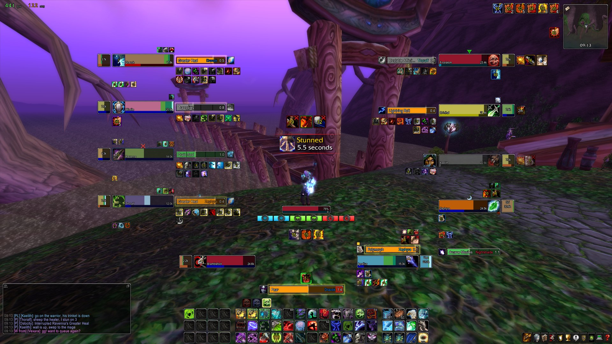

<p align="center"><i>The «Arena» layout in test mode (<code>/uftest</code>): your team on the left, the enemies on the right,
castbars facing the center, cooldowns and diminishing returns next to every frame.</i></p>

---

## Why FrostAtom UI?

- 🧩 **One addon instead of twenty.** Action bars, unit, arena and raid frames, nameplates, castbars, cooldown timers,
  trackers, bags, chat, tooltips: one package that looks and behaves the same everywhere.
- ⚔️ **Made for arena.** Diminishing returns, enemy trinkets and cooldowns, kicks, crowd control, a voice that calls
  out dangerous spells, and a history that remembers every game.
- 🪄 **Ready in a minute.** A short setup wizard picks the layout and options for your role. Don't like the result?
  One click undoes it.
- 🎯 **See the fight, not the clutter.** Dangerous casts glow, casts aimed at you get a red border, abilities you can't
  use while crowd controlled turn red on your bars.
- 🛠️ **Every pixel is yours.** Drag, resize and snap any frame, pick one of eight ready-made layouts, share yours with
  friends as a text string.
- 🌍 **English and Russian**, picked automatically from your game client.

<details>
<summary><b>🔁 Coming from other addons? Here is what replaces what</b></summary>

| You used to install | In FrostAtom UI |
|---|---|
| Bartender4, Dominos | Action bars |
| ShadowedUnitFrames, PitBull, X-Perl | Unit frames |
| Gladius, sArena, Gladdy | Arena frames |
| Grid, VuhDo, HealBot | Raid frames |
| TidyPlates, Kui Nameplates, Aloft, NotPlater | Nameplates |
| Quartz | Castbars |
| OmniCC | Cooldown numbers on every icon |
| OmniBar, OmniCD, Afflicted | Cooldowns of both teams |
| DRTracker, DiminishingReturns | Diminishing returns |
| LoseControl, BigDebuffs | Loss of control alert, crowd control on frames |
| SoundAlerter | Spell alerts (voice) |
| TellMeWhen | Trackers |
| InternalCooldowns | Trinket and enchant proc cooldowns |
| TipTac | Tooltips |
| Bagnon, AdiBags, ArkInventory | Bags |
| Prat, Chatter | Chat |
| SexyMap, Mapster | Minimap, world map |

When FrostAtom UI meets one of them, it asks what to keep: FrostAtom UI, the other addon, or both.

</details>

> The project is under active development, so options may move around between versions.
> Questions, ideas and bug reports: **[Discord](https://discord.gg/HSD3gCYw8Q)**.

---

<a id="install"></a>

## 📦 Installation

1. Download the latest version: [**Releases**](https://github.com/FrostAtom/FrostAtomUI/releases/latest) →
   `FrostAtomUI-<version>.zip`. Without a release yet, use **Code → Download ZIP**.
2. Unpack it. Inside are two folders: `FrostAtomUI` and `FrostAtomUI_Config` (in the **Download ZIP** archive they
   sit one level deeper, in `FrostAtomUI-main`).
3. Move **both** of them to your game's addon folder:

   ```
   World of Warcraft\Interface\AddOns\FrostAtomUI
   World of Warcraft\Interface\AddOns\FrostAtomUI_Config
   ```

4. Restart the game completely (`/rl` doesn't load new addons) and make sure **FrostAtom UI** is ticked in the
   *AddOns* list on the character selection screen.

That's it. Log in and the setup wizard greets you.

---

<a id="first-start"></a>

## 🪄 First start: set up in a minute

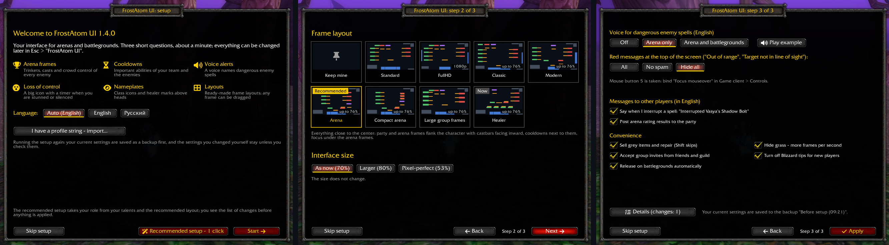

A short wizard opens on your first login. Every step can be skipped.

1. **You:** healer or damage (already guessed from your talents), and where you play: arena, battlegrounds or both.
2. **Screen:** the frame layout with live previews, and the interface size: as now, larger, or pixel-perfect.
3. **Signals:** the spell alert voice, red error messages, mouse button 5 to focus, interrupt messages to your party.

In a hurry? **Recommended setup - 1 click** does it all for you. Before anything changes you can open the exact list of
changes and untick what you don't want. A backup is saved first, and **Undo setup** is one click away afterwards.
Then a 4-step tour shows how to move frames.

Run it again any time with `/fui setup`.

### Pick a layout

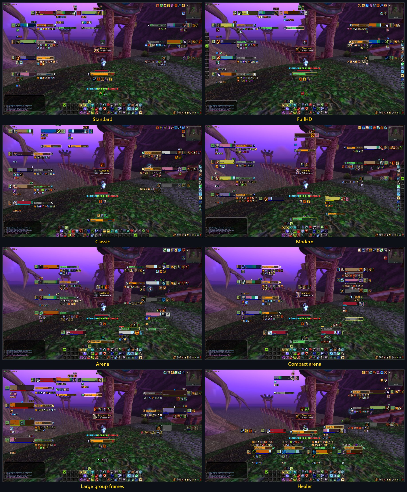

| Layout | In short |
|---|---|
| **Standard** | FrostAtom UI's own starting layout |
| **FullHD** | Standard fitted to a 1920x1080 screen, vertical bars on the sides |
| **Classic** | Like the default game: portraits in the top-left corner, party under them |
| **Modern** | Player and target on both sides of your character, focus at the top |
| **Arena** | Everything close to the center, castbars facing inward |
| **Compact arena** | Gladius style: small arena frames with the castbar and cooldowns under each |
| **Large group frames** | Big, easy-to-click party and arena frames with large text |
| **Healer** | Party frames in a row above your bars, castbars and cooldowns on top |

Each layout has a compact variant that switches on by itself for big interface scales. Change it any time under
*Layouts*, or save your own.

---

<a id="match"></a>

## ⚔️ A match, start to finish

### 1. The queue pops

- A clear **"Match found!"** window with the bracket and a countdown bar, and the invite sound even with game sounds
  muted. An optional full-screen flash catches you while alt-tabbed.
- **Solo queue button** by the minimap *(WoW Circle)*: join, leave or enter with one click, see your time in queue.

### 2. The gates are closed

- **Preparation frames** show how many enemies to expect and fill in class, spec and name as soon as they are seen.
- A big **countdown** to the start, and a **pillar timer** in the Ring of Valor.

### 3. The fight

#### Unit frames and castbars

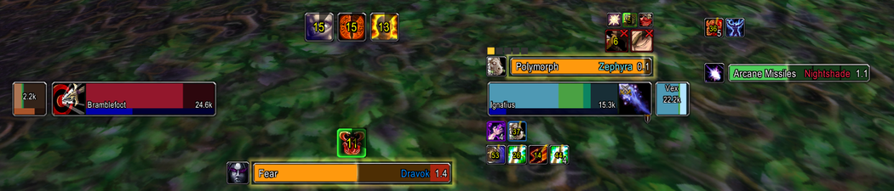

- **Player, pet, target, focus**, their targets, plus party, arena and raid frames.
- **Incoming heals and shields** right on the health bar. Absorbs (Power Word: Shield, Divine Aegis, Sacred Shield,
  Ice Barrier, …) shrink as they soak damage.
- Class icon, spec icon or portrait, class colors or red → green by health, a highlight on purgeable buffs and
  dispellable debuffs, a big **crowd control icon** while someone is locked down.

**Castbars that read the fight for you**, on every frame and nameplate:

- 🎯 the name of the player the spell is aimed at, and a **red border when it's aimed at you**;
- ✨ a pulsing **gold glow on dangerous casts**: crowd control and heals;
- 🛑 *Interrupted by &lt;name&gt;* in red when someone kicks it, a grey *Cancelled* when the caster fakes it;
- 🛡️ casts that can't be kicked right now are marked as such;
- channel ticks, your latency on your own castbar, remaining or *elapsed / total* time.

#### Your team and the enemies

| Party | Arena |
|:---:|:---:|
| 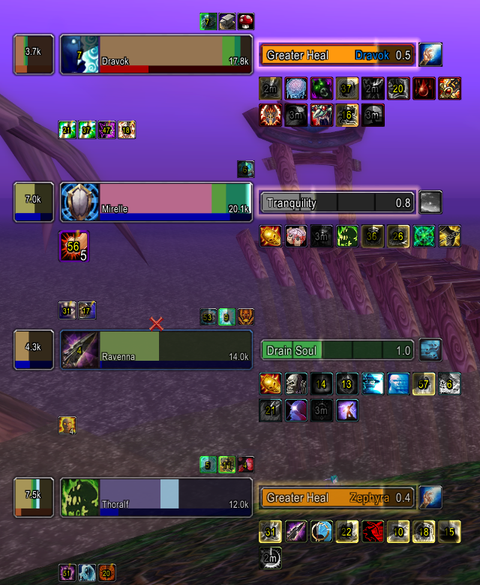 | 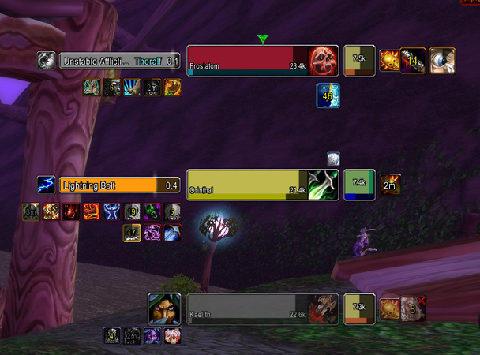 |
| Cooldowns, crowd control and casts of your teammates | Trinket, cooldowns, diminishing returns, a faded frame for stealthed enemies |

- **Diminishing returns** on arena frames and on your own character, and on party, target and focus if you like:
  one icon per category with a timer. The border tells what the next crowd control does:
  🟢 half duration, 🟠 a quarter, 🔴 immune. Pick where the icons sit and which way they grow.
- **Every cooldown of both teams** next to their frames: defensives, burst, interrupts, crowd control, mobility.
  Dark with a timer while on cooldown, glowing while active, flashing when ready. Choose which spells matter to you.
- **Trinkets and procs.** PvP trinkets, plus when Deathbringer's Will, Greatness, Lightweave, Black Magic and friends
  can proc again. Unknown enemy trinkets fill in after their first proc and are remembered.
- **Stealthed enemies stay on screen**, faded, with their last known health and power.

#### Crowd control and alerts

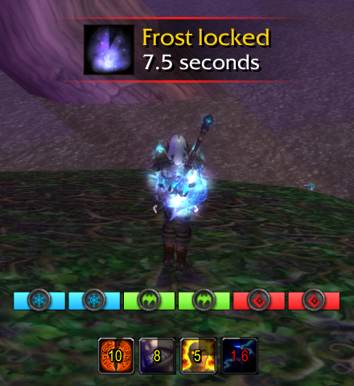

- **Loss of control alert** in the middle of the screen: *Stunned*, *Feared*, *Silenced*, *Frost locked* after a kick,
  with the seconds left. While you're locked, every ability you can't use turns red on your bars.
- **External defensives:** a row of what your team puts on you (Pain Suppression, Guardian Spirit, Hand of
  Protection, Power Infusion, …), longest first.
- 🔊 **Spell alerts:** a voice calls out dangerous enemy spells: *"Polymorph"*, *"Trinket"*, *"Divine Shield"*,
  *"Divine Shield down"*. Hear the list and pick your spells under *Alerts → Voice*.
- Optional sounds when an enemy targets you, when your target starts a cast you can kick, and when your kick lands.
- **Low health:** the screen edges pulse red below 33%.

#### Nameplates

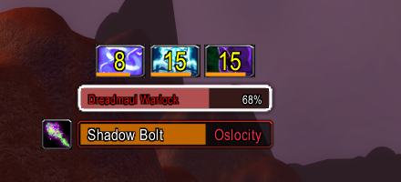

- Same look as the unit frames: name inside the bar, health percent on your target.
- **Casts and crowd control** on the plates of your target, focus, mouseover, arena enemies and your group's targets.
- **Auras sorted by importance:** your crowd control first, then others', enemy defensives, your debuffs and
  purgeable buffs.
- **Arena numbers**, enemy combo points, class colors, a **healer icon** over enemy healers.
- Totem icons with a timer instead of totem plates, a hide list for pets like Mirror Image and Treants.

### 4. After the fight

| Match results | Death recap |
|:---:|:---:|
| 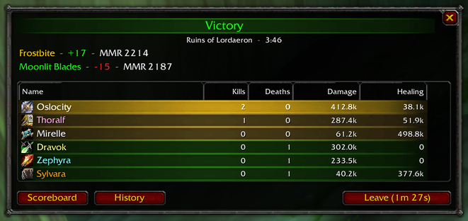 | 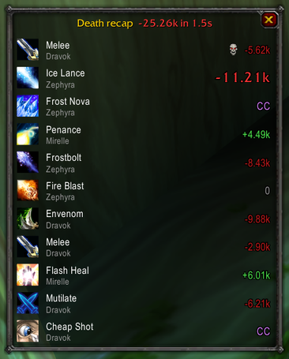 |

**Match results.** When an arena or battleground ends, you get a summary: result, map, duration, rating change, team
MMR and a sortable scoreboard, plus a countdown until the instance closes.

**Death recap** (`/recap`). What killed you: spell, caster, amount, heals and crowd control, the killing blow marked with
a skull, and how much you took in the last 1.5 seconds. A clickable *[Death recap]* link appears in chat after every
death. In arenas, **every player's death** gets one, yours, your teammates' and the enemies'.

**Arena history** (`/history`). Every 1v1, 2v2, 3v3 and solo queue game is saved with the full scoreboard, games you
left early too. Filter by bracket or enemy team, search by team or player, click a game for the details. Your win rate
is at the top.

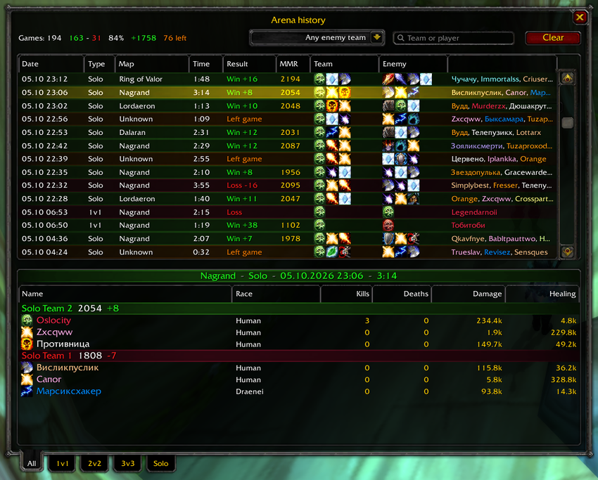

---

<a id="battlegrounds"></a>

## 🏰 Battlegrounds

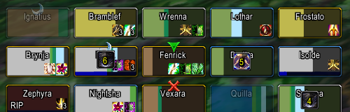

- **Raid frames** for battlegrounds: sorted by group, class or name, crowd control in the middle, dispel borders,
  your heals over time and shields.
- **Healer icons** over enemy healers, taken from the scoreboard.
- Spirit released right after death (hold **Shift** to stay), warnings before the instance closes.
- Join and leave floods folded into one chat line.
- **Vehicles** in Wintergrasp, Strand of the Ancients and Isle of Conquest show the vehicle's health and power.

---

<a id="everyday"></a>

## 🧰 Everyday comfort

### 🕹️ Action bars

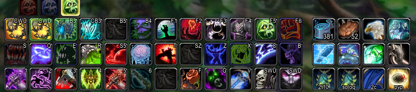

- Up to ten bars plus pet, stance and totem bars. Buttons, size, columns and spacing for each bar.
- **Out of range** turns the icon red. Fade on mouseover, or show a bar only in or out of combat.
- **Quick keybinding:** type `/bind`, hover a button, press a key.
- No more spells dragged off by accident: move them with **Shift + drag** (or the key you choose).

### 📝 Macros without limits

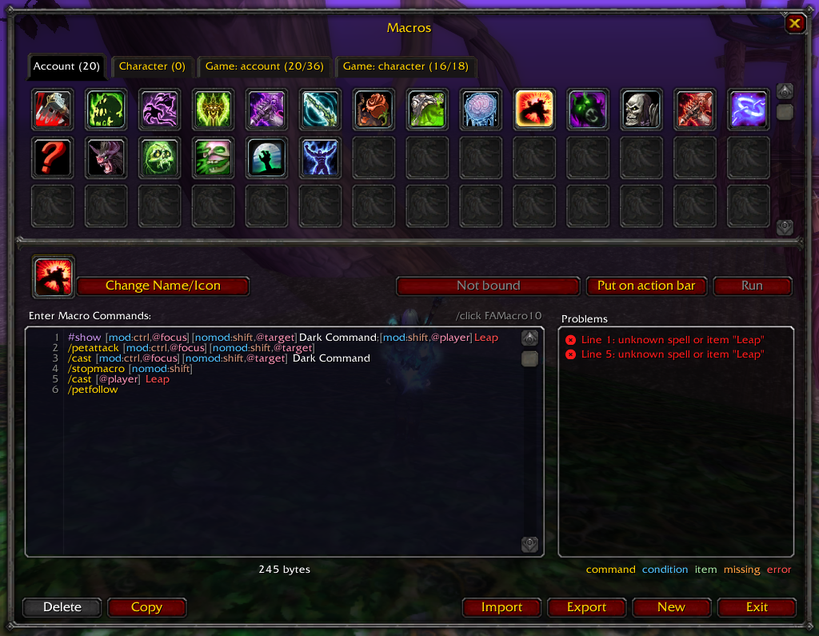

- `/macro` opens an editor with **no limit** on the number of macros or on their length.
- **Syntax highlighting** with a live problem list: typos in conditions, unknown spells, missing items.
- Bind a key right in the window, pick an icon with search, share macros as a text string.

### 📖 Spellbook and talents

| Spellbook | Talents and glyphs |
|:---:|:---:|
| 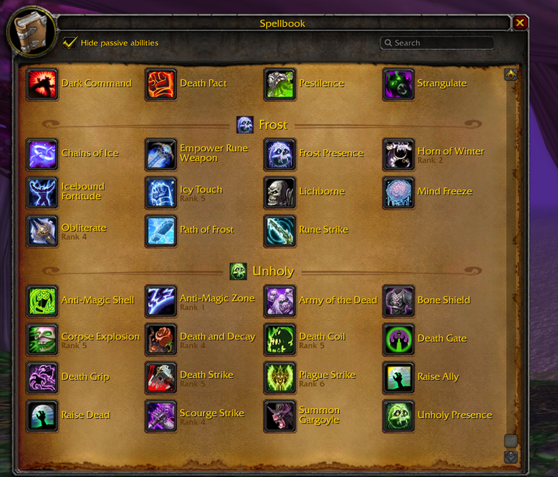 | 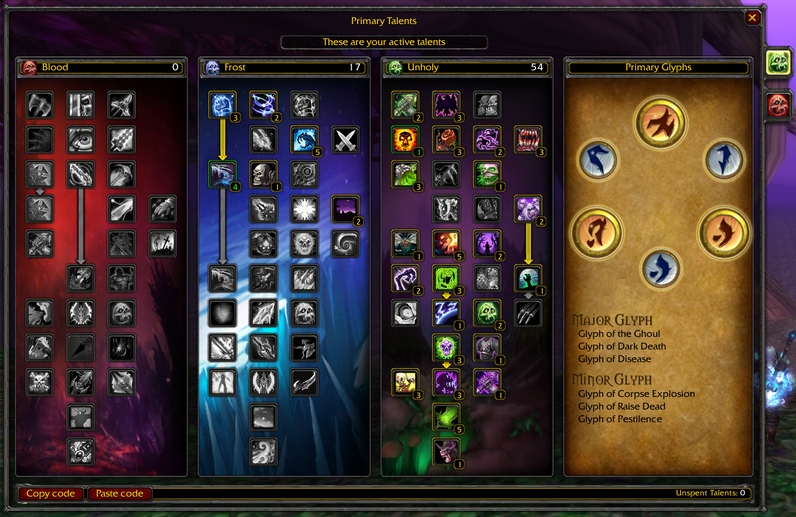 |

- **The whole spellbook on one page** with search and a *Hide passive abilities* switch.
- **All three talent trees side by side**, dual spec, glyphs next to them, a preview before you learn.
  Copy or paste a build as a Wowhead talent code.

### 🎒 Bags and vendors

| Bags | Vendor |
|:---:|:---:|
| 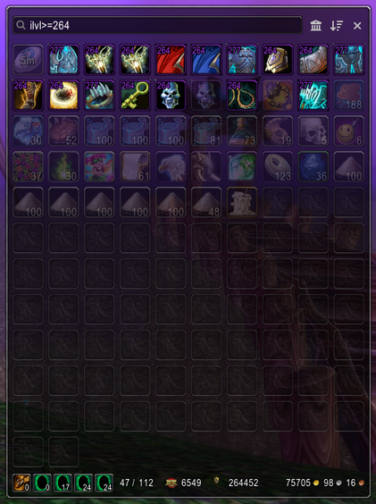 | 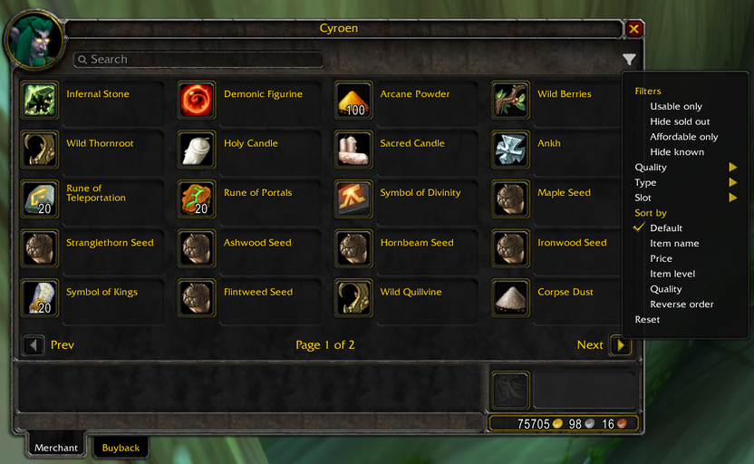 |

- **All bags in one window**, sorting, quality borders, the currencies you track, and your bank viewable anywhere.
- **Smart search:** `q:epic`, `ilvl>=251`, `t:plate`, `tt:resilience`, `boe`, `!` to negate.
- **Vendors** get the same search, filters (usable only, affordable only, hide known) and sorting.
  Greys are sold and gear is repaired for you (hold **Shift** to skip).

### 💬 Chat

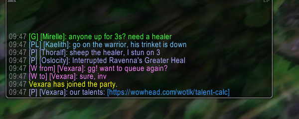

- Short channel tags (`[P]`, `[R]`, `[BG]`, `[W from]`), timestamps, class-colored names, clickable links.
- **History survives a reload**, long messages split by themselves, a *jump to bottom* button.
- **Less spam:** battleground joins and arena preparation noise folded or hidden.
- `/wt ` whispers your target, `/gr ` talks to your group, `/nodm` holds whispers from strangers until you're free.

### 🗺️ Minimap and map

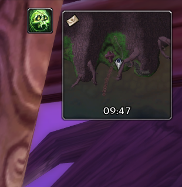

- Square minimap, addon buttons tidied into one panel, the clock and the queue eye where you want them.
- Borderless world map you can play with open: zoom with the wheel, drag to pan, see coordinates and class-colored
  group icons.

### 🔍 Tooltips, character and inspect

| Tooltip | Character |
|:---:|:---:|
| 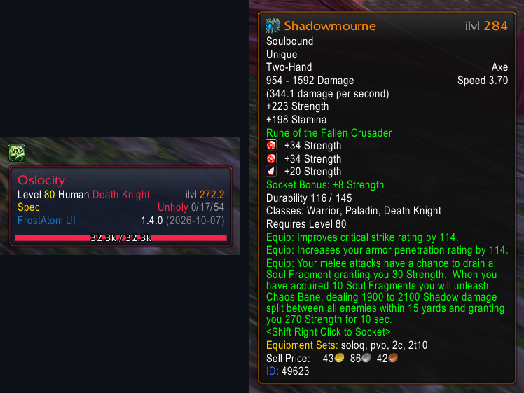 | 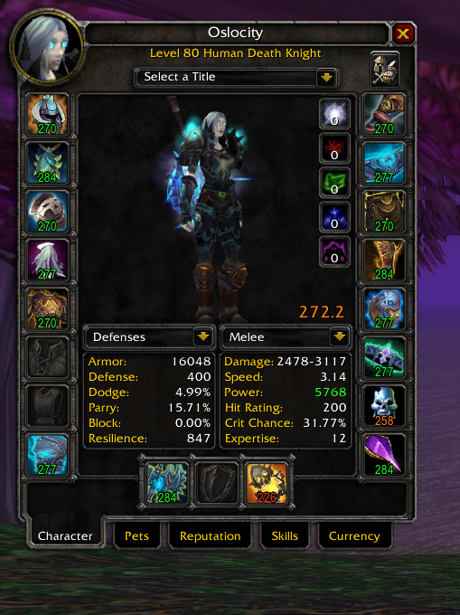 |

- Player tooltips show **item level, talent spec and arena ratings**, guild rank and what they're targeting.
- **Item level on every slot** of the character window. Rotate, move and zoom the model with the mouse.

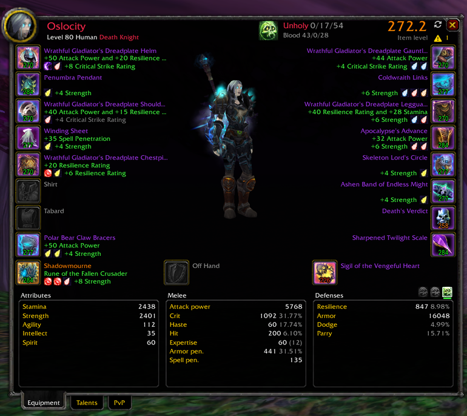

| Talents | PvP record |
|:---:|:---:|
| 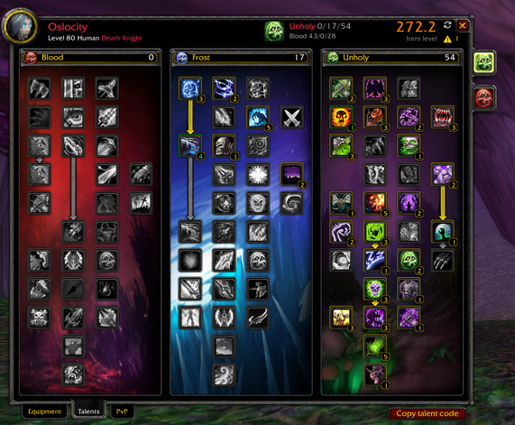 | 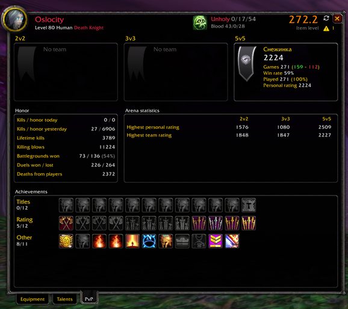 |

A new **inspect window**: every item with enchants and gems (missing ones flagged), **real character stats** with
resilience and percentages, both talent specs, arena teams, statistics and PvP achievements. It follows your target.

### 🧩 AddOn list

*Esc → AddOns* opens a new list with search, groups, dependencies and memory use.

### 🛠️ On autopilot

| When | What happens | By default |
|---|---|:---:|
| You visit a vendor | Greys sold, gear repaired (hold **Shift** to skip) | ✅ |
| You die in a battleground | Spirit released right away (hold **Shift** to stay) | ✅ |
| A battleground ends | Warnings 10, 5 and 1 min and 15 s before the instance closes | ✅ |
| Someone trades you in combat | Declined | ✅ |
| A friend or guild mate invites you | Accepted | ➖ |
| You interrupt a spell | Announced to your group (`/ia` toggles it) | ➖ |
| You delete a good item | `DELETE` typed for you | ➖ |
| Duels, invites, trades | Declined silently (`/noduel`, `/noparty`, `/notrade`) | ➖ |

✅ on from the start · ➖ one click away in the settings or the setup wizard

### 🎮 Game client tweaks

Hidden game settings, one click away, all off until you turn them on:

- **Camera:** faster zoom, look speed beyond the game's limits, three distance presets on keys.
- **Controls:** casting no longer dismounts you or cancels your form, Windows-exact mouse speed.
- **Graphics:** no screen glow, grey death screen or sun glare, no grass, brighter characters in dark arenas.
- **Performance:** FPS limits, a one-click *Arena performance* preset.
- **Sound:** quieter armor rustle, sound from your character's position.

Everything goes back to how it was with *Restore game settings*.

---

<a id="settings"></a>

## ⚙️ Make it yours

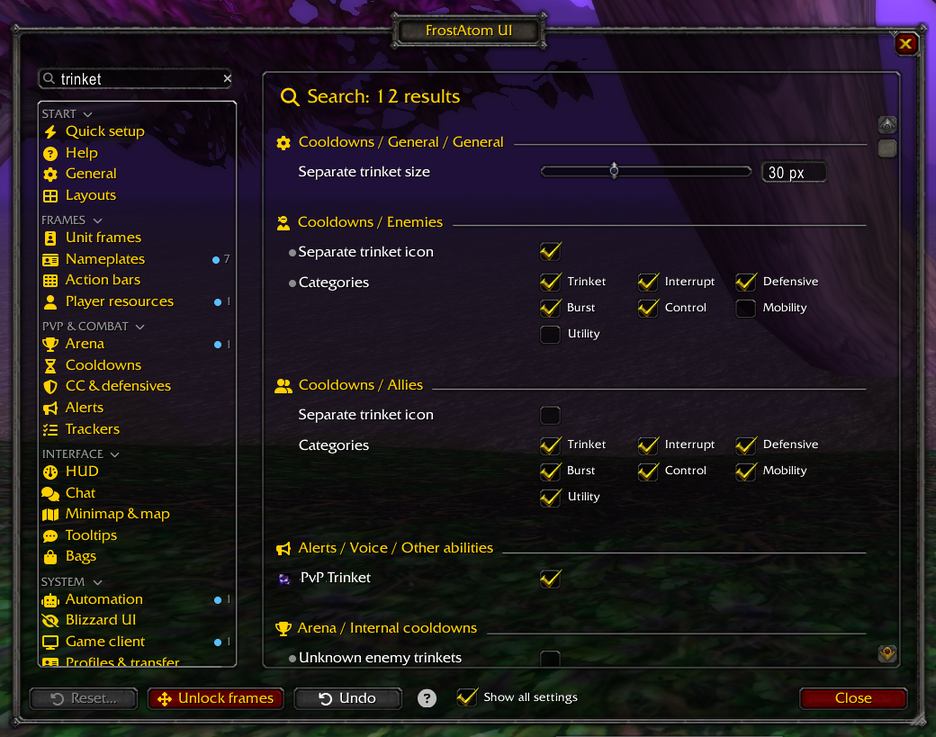

Type **`/fui`** or press **Esc → FrostAtom UI**. Nearly everything applies instantly.

- 🔎 **Search** any option: `/fui castbar` or `/fui arena trinket`. New options wear a **NEW** badge, settings you
  changed get a blue dot.
- ↩️ **Undo** with a button or **Ctrl+Z**, reset a single page, see what a setting was before.
- 🧪 **Test buttons** preview frames, diminishing returns, loss of control and alerts without waiting for a fight.
- 📚 **Help page** with getting started, answers to common questions and every command.

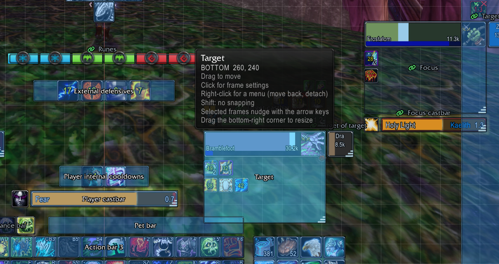

- 🧲 **Move frames** (`/fui unlock`): drag anything anywhere. Frames snap to each other and to the screen, stay
  attached to their neighbor, resize from the corner and nudge with the arrow keys. An alignment grid and an overlap
  check help keep things tidy.
- 👥 **Profiles** per character or per talent spec. Export a profile, a layout or only your changes as a string.
- 💾 **Backups** are saved before every big change. Restore one with `/fui restore`.
- 🚚 **Moving to a new PC?** *Game settings transfer* packs your macros, action bars, key bindings, chat windows and game
  options into one string.

---

<a id="commands"></a>

## ⌨️ Slash commands

| Command | What it does |
|---|---|
| `/fui [text]` | Open the settings or search them (`/fui chat`, `/fui castbar`) |
| `/fui unlock`, `/fui lock` | Move frames / lock them back |
| `/fui setup` | Run the setup wizard again |
| `/fui reset` | Move every frame back to the current layout |
| `/fui restore` | Open the backups |
| `/fui help` | All commands |
| `/uftest` | Fill every frame with test data |
| `/bind` | Keybinding mode for action buttons |
| `/macro` | Macro editor |
| `/history` | Arena history |
| `/recap` | Death recap |
| `/sort`, `/sortbank` | Sort bags / bank |
| `/nodm [message]` | Hold whispers from strangers, with an optional auto-reply |
| `/noduel`, `/noparty`, `/notrade` | Auto-decline duels, invites, trades |
| `/ia` | Interrupt announcements on / off |
| `/wt <text>`, `/gr <text>` | Whisper your target / talk to your group |
| `/copy` | Copy text from the chat |
| `/rl` | Reload the interface |

**Key bindings** (*Esc → Key Bindings → FrostAtom UI*): open the settings, move frames, keybinding mode, macros,
focus mouseover, target or focus arena enemies 1-3, and three camera distance presets.

---

<a id="faq"></a>

## ❓ FAQ

**Do I need to remove my other addons?**
Only the ones that do the same job (see the table at the top). FrostAtom UI notices them and asks whether to disable
that addon, turn off its own part, or keep both.

**Does it work on my server?**
It needs the **3.3.5a** client (build 12340) and works on any Wrath private server. A few extras (solo queue button,
restyled arena NPC windows) are for WoW Circle, and *Spectate* needs a server with spectator mode.

**I changed too much. How do I go back?**
*Undo setup* in the window after the wizard, **Ctrl+Z** in the settings, or `/fui restore` for a backup. To try the
default game interface again, use *Blizzard UI → Bring back the Blizzard interface*.

**How do I keep my settings when I reinstall or move to another PC?**
Copy `WTF\Account\<account>\SavedVariables\FrostAtomUI.lua`, or export a profile string from *Profiles*.

**Can I play in Russian?**
Yes. The language follows your game client, and you can switch it under *General → Language*.

---

<div align="center">

**Something missing? Found a bug? Got a cool layout to share?**
Come say hi on **[Discord](https://discord.gg/HSD3gCYw8Q)**.

</div>
